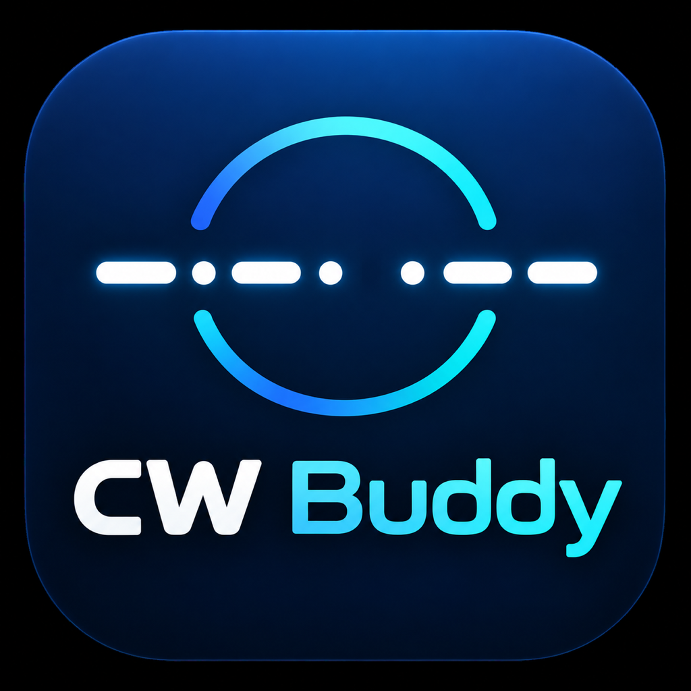

# CW Buddy

<p align="center">
  
</p>

CW Buddy is a modular, cross-platform C++ application for receiving,
visualizing, decoding, and operator-assisted replying to amateur-radio CW. The
target platforms are Windows 11 or newer on x64, macOS Sonoma 14 or newer on
Apple silicon and Intel x64, and Linux; Windows is the first packaging target.

The project is in active pre-release development, and unsigned desktop builds
are published for every supported platform on each green run. A dependency-free
core supplies the primitives and their tests. The Qt Quick desktop application
above it runs the whole receive path: a profile chooser, guided setup,
persistent radio/keying/display settings, native live audio-input
discovery/capture through a bounded queue and dedicated DSP worker, direct SDR
reception, radio frequency control, and a guarded transmit and QSO panel that
cannot be armed by the decoder. WAV replay remains a separate deterministic
source for the real 2D spectrum and waterfall, and a direct SDR source can be
recorded as an interoperable SigMF IQ pair for later analysis. Immediate
controls below the spectrum provide signal gain/bandwidth, constant-time
high-resolution history, a CW frequency guide, and stable noise-suppressed
display tuning. A receive-only full-passband channel
bank detects multiple spectral peaks, then derives independent keying evidence
from the original samples through a phase-continuous narrowband filter for each
frequency. It evaluates bounded 8–60 WPM timing hypotheses, maintains adaptive
timing state, and shows color-linked spectrum markers and decode rows. The
700 Hz guide is visual only. Multiple-pass weak-signal decoding remains under
active implementation.

## Current and planned capabilities

- Advanced live-audio channel, sample-rate, buffer, calibration, and level-meter
  controls (cross-platform capture plus DC rejection, manual/automatic gain,
  and manual/automatic processing bandwidth are implemented)
- Direct receive-only RTL-SDR IQ reception through the SoapySDR module provided
  by official packages; SDRplay reception uses the same internal boundary
  after the operator installs the compatible vendor API and SoapySDRPlay3
  module. Physical-device qualification remains in progress.
- Selectable receive-only network SDR directory, with KiwiSDR streaming first
  and browser handoff for receiver types without an authorized client API
- Debug capture of a direct SDR source as an interoperable SigMF IQ pair
  (`ci16_le` by default), bounded by an explicit byte and duration budget
- Live-source and WAV-replay spectrum with scrolling waterfall
- Alternative-width/drift refinement of the implemented raw-sample narrowband
  full-passband multi-channel decoder
- Strongest-signal, arrival-queue, and operator-selected channel scheduling
- Configurable 2D spectrum bounds, FPS, waterfall speed, averaging, peak hold,
  palettes, overlays, and delayed callsign detail cards
- Persistent callsign ignore list enforced by display, queue, and TX safety
- Standalone, station-server, and remote-client roles with secure control,
  receive audio/spectrum streaming, and station-local CW timing
- Multiple saved station profiles with a startup chooser and isolated settings,
  allowing separate application instances to operate separate radios
- Windows OmniRig, portable Hamlib, and CAT4OM network frequency-control paths
- Yaesu FT-450D and FT-818/FT-818ND editable reference configurations
- Separate configurable serial port and RTS/DTR lines for PTT and keying
- Human-confirmed QSO initiation with ordinary, DX-pileup, and contest panels
- ADIF 3 records sent to Log4OM 2 through its inbound UDP integration
- Deterministic replay of audio and IQ captures for decoder regression tests
- A documented high-accuracy decoder plan with explainable timing, optional
  compact causal inference, multiple-pass weak-signal refinement, and
  same-frequency pileup separation

## Architecture

The real-time capture callback only packages samples into a bounded SPSC ring.
A DSP worker performs shared spectral analysis and bounded per-track raw-sample
mixing/filtering. Each channel has its own filter, timing, decoder, and
confidence state; it does not own an operating-system thread. A bounded worker
pool remains planned for later expensive refinement passes.

See [the architecture](docs/architecture.md), [requirements](docs/requirements.md),
[prioritized backlog](BACKLOG.md), [changelog](CHANGELOG.md), and
[roadmap](docs/roadmap.md). Operator-facing setup and examples are maintained in
the [user manuals](docs/manuals/README.md). The graphical architecture is recorded in
[ADR 0001](docs/decisions/0001-qt-quick-spectrum-renderer.md).
The proposed decoder pipeline and measurable acceptance gates are in the
[high-accuracy decoder strategy](docs/decoder-strategy.md).
ADIF release gates and official-fixture verification are documented in the
[ADIF conformance policy](docs/adif-conformance.md).

## Download current development binaries

The following unsigned builds are published only after the complete hosted
matrix and core tests pass:

- [Windows 11 x64 installer](https://github.com/alessiobravi/CW-Buddy/releases/download/continuous/cw-buddy-windows11-x64.msi)
- [Debian/Ubuntu x64 `.deb`](https://github.com/alessiobravi/CW-Buddy/releases/download/continuous/cw-buddy-debian-ubuntu-x64.deb)
- [Linux x64 portable archive](https://github.com/alessiobravi/CW-Buddy/releases/download/continuous/cw-buddy-linux-x64.tar.gz)
- [macOS Sonoma 14+ Apple silicon](https://github.com/alessiobravi/CW-Buddy/releases/download/continuous/cw-buddy-macos-arm64.tar.gz)
- [macOS Sonoma 14+ Intel x64](https://github.com/alessiobravi/CW-Buddy/releases/download/continuous/cw-buddy-macos-x64.tar.gz)

See the repository [binary index](binaries/README.md) for checksums, the
machine-readable manifest, and installation notes. The public release assets
can be downloaded without GitHub authentication.

## Build the current core

Requirements: a C++20 compiler and CMake 3.24 or newer.

```sh
cmake --preset dev
cmake --build --preset dev
ctest --preset dev
```

The development host starts in a hardware-safe state:

```sh
./build/dev/src/app/cw-buddy
```

The Qt desktop shell requires Qt 6.5 or newer with Quick, Quick Controls, QML,
SerialPort, and WebSockets:

```sh
cmake -S . -B build/desktop -DCWA_BUILD_DESKTOP=ON
cmake --build build/desktop
./build/desktop/src/desktop/cw-buddy-desktop --profile default
```

When multiple station profiles exist, the desktop opens a profile chooser.
`--profile NAME` bypasses the chooser for dedicated shortcuts, remote stations,
and parallel instances.

The desktop currently uses Qt 6, including Qt Multimedia for audio capture.
Official packages enable direct SDR reception and provide the redistributable
SoapySDR and RTL-SDR runtime, either inside a portable package or through the
Linux `.deb` dependency. SDRplay additionally requires the operator to install
the vendor's platform-specific API/driver and a compatible SoapySDRPlay3
module; CW Buddy does not redistribute that proprietary runtime. No separate
SDR application is needed. Custom source builds use
`-DCWA_ENABLE_SOAPY_SDR=ON` and the matching development package.

Every push to `main` and pull request builds and tests natively on Windows x64,
Linux x64, macOS ARM64, and macOS x64 with a Sonoma 14 deployment target, then
publishes downloadable desktop artifacts; Linux also produces a Debian/Ubuntu `.deb`. Pull requests containing
implementation, test, build, or workflow changes must update the user manuals,
changelog, and backlog.

## Safety

Decoded text can never directly assert PTT or KEY. Transmission starts
disarmed, requires an explicit arm action, a selected callsign, a matching
operator confirmation, and a healthy keying adapter. Timeouts and emergency
release are required before hardware TX is enabled.

## License

CW Buddy is licensed under the GNU General Public License v3.0 or later
(`GPL-3.0-or-later`). See [LICENSE](LICENSE) and the
[dependency licensing policy](docs/licensing.md).

## Author

Alessio Bravi (IU0LFQ / AD2FC) — [https://iu0lfq.it/](https://iu0lfq.it/)
