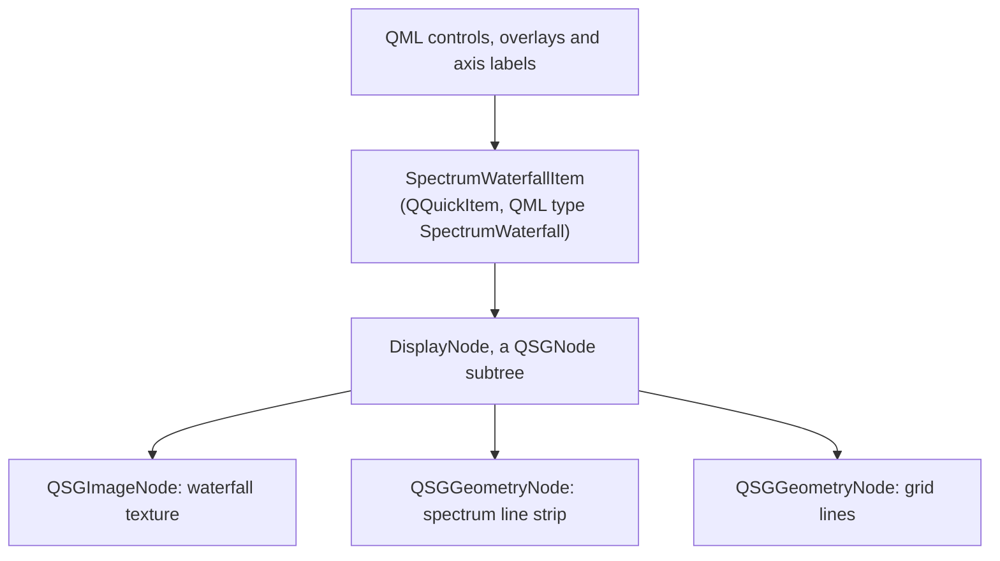

# ADR 0001: Qt Quick scene-graph spectrum renderer

Status: accepted

Date: 2026-08-30

## Context

The project needs a responsive, zoomable spectrum and waterfall on Windows 11
x64, macOS, and Linux while DSP and multiple CW decoders run concurrently. The
UI must remain responsive under load, expose clickable channels/callsigns, and
retain a portable fallback when accelerated features are unavailable.

## Decision

Use Qt 6 Quick/QML for controls and layout, with a custom C++ `QQuickItem` for
the real-time visualization:

QML controls and layout drive a single public `SpectrumWaterfallItem`, which
owns a `DisplayNode` holding one `QSGImageNode` for the waterfall and two
`QSGGeometryNode`s, one drawing the spectrum as a line strip and one drawing
the grid, both with a flat colour material. The waterfall raster is coloured on
the CPU into a full-colour image and uploaded as a new texture each frame; the
image node owns and releases the previous texture. Frequency tick labels, the
decoder-window overlay, the channel markers with their callsign labels, and
every pointer interaction are QML items layered over the render item rather
than scene-graph nodes, so the item itself performs no hit testing.

No shader is written or compiled: the CPU colour mapping means the baseline
needs neither Qt Shader Tools nor a custom material. Qt's rendering abstraction
selects Direct3D on Windows, Metal on macOS, and Vulkan/OpenGL as available on
Linux. Reporting the active API and any fallback reason in the diagnostics
remains to be implemented.

The display is deliberately two-dimensional. GPU work must improve clarity,
latency, or efficiency of an operating feature; visual novelty by itself is not
sufficient scope.

## Module boundaries

- `SpectrumSnapshot`: immutable, renderer-neutral bins and frequency mapping,
  carrying bin width, the window's equivalent noise bandwidth, a sequence
  number, a timestamp, and the unaveraged bins alongside the averaged ones.
- `SpectrumFrame`: the queued-signal payload that carries one snapshot's bins
  and bounds from the capture worker to the render item. Transfer is a queued
  Qt connection rather than a shared queue, so the producer never holds a lock
  the render item waits on. The lock-free `SpscRingBuffer` sits earlier, in
  `LiveAudioPipe`, between the audio callback and the capture worker.
- `DisplayNode`: the scene-graph subtree described above.
- `WaterfallConditioner`: display-only per-bin baseline estimation and
  side-reference comparison; it never feeds the decoder.
- `SpectrumWaterfallItem`: property, view-range, noise-floor and interaction
  coordinator. It also holds the waterfall history, as a row deque bounded by
  the configured row capacity, and counts rows lost to a sequence gap.
- Peak-hold geometry, a separate palette material, an overlay node and a
  render-metrics type are not yet separated out. Presentation rate is limited
  by a `targetFps` property and dropped rows are counted, but upload volume and
  sync/render latency are not yet measured.

The displayed range is derived from an estimated noise floor rather than from
the raw bin extremes. That floor is the median of the finite bins in a frame,
smoothed asymmetrically so it follows an AGC-driven rise faster than it
releases. The trace baseline then sits twelve decibels below the floor,
`kTraceFloorHeadroomDb`, because a floor drawn along the bottom axis tells an
operator nothing about how far a signal stands above it. The waterfall palette
starts higher than that baseline whenever the automatic range is in use, so
none of the palette's range is spent colouring noise. Retuning slides the
stored waterfall rows by the number of bins the band moved rather than erasing
them, so history survives a frequency change; only a changed span drops the
rows, because the bins no longer mean the same width.

For an audio stream the dispatcher calculates one windowed CPU FFT and
publishes its result to both detection and display. A complex-IQ stream runs a
second transform, because the wide overview and the channelized decoder slice
are different signals: the overview is analyzed at 16'384 bins for the display
while the decoder analyzes only its extracted slice. Rendering may drop
presentation snapshots under load, but DSP processing has a separate queue and
priority policy. GPU compute is deferred until profiling of wide SDR sample
rates demonstrates a benefit.

## Backend policy

The baseline must build using Qt's public Quick and Scene Graph APIs. The
portable path in use is a CPU-generated full-colour texture rebuilt each frame,
sized in display columns rather than in FFT bins so a wide SDR span is reduced
before the raster is built instead of during minification. An 8-bit intensity
texture with a GPU palette shader, a partial-row float-texture uploader or a
GPU compute backend may be added later only behind a narrow interface and build
option. If one needs Qt private APIs, CI must pin the exact Qt minor version
and the packaged fallback must remain functional.

A widget plotting library is not used for the real-time waterfall. It may be
used only for low-rate diagnostic plots where a widget model is appropriate.

## Explicit visual non-goals

- 3D or perspective spectrum history
- animated backgrounds, bloom, glow, particle, or ornamental shader effects
- simulated instrument treatments that reduce data density or legibility
- duplicate visual modes without an operating or diagnostic use case

Themes, palettes, peak hold, averaging, and accessible contrast remain in scope
because they improve signal interpretation rather than decorate it.

## Threading and ownership

DSP owns sample and spectral computation. The GUI thread owns QML state. The Qt
render thread owns scene-graph nodes and GPU resources. Cross-thread transfer
uses bounded snapshots with sequence numbers; no thread receives pointers into
another thread's mutable storage.

GPU resource creation, updates, and destruction occur only at Qt-sanctioned
scene-graph phases. Cleanup is scheduled on the render thread when required.
Backend-native image nodes are created only after a valid texture exists, own
their render-thread textures, and are retained with an empty rectangle across
receiver resets. A texture node with null texture is invalid Qt scene-graph
state and must never be added or updated.

## Consequences

- The core stays independent of Qt and can be tested without a display.
- CPU spectrum bins are the single source of truth for visible frequency
  coordinates and CW channel detection.
- We accept a potentially less efficient full-texture fallback before adding a
  private graphics optimization; profiling and correctness come first.
- Accelerated and fallback rendering require replay/golden-image tests and
  native CI smoke tests. Today the fallback path is covered by an offscreen
  scene-graph test that drives the item through `updatePaintNode` on the
  software backend, and by the QML startup smoke test; golden-image comparison
  is still to be added.
