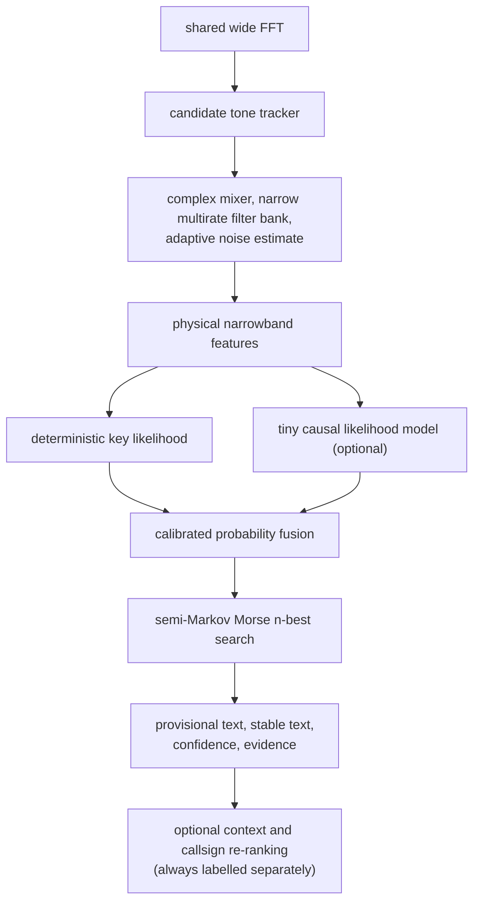
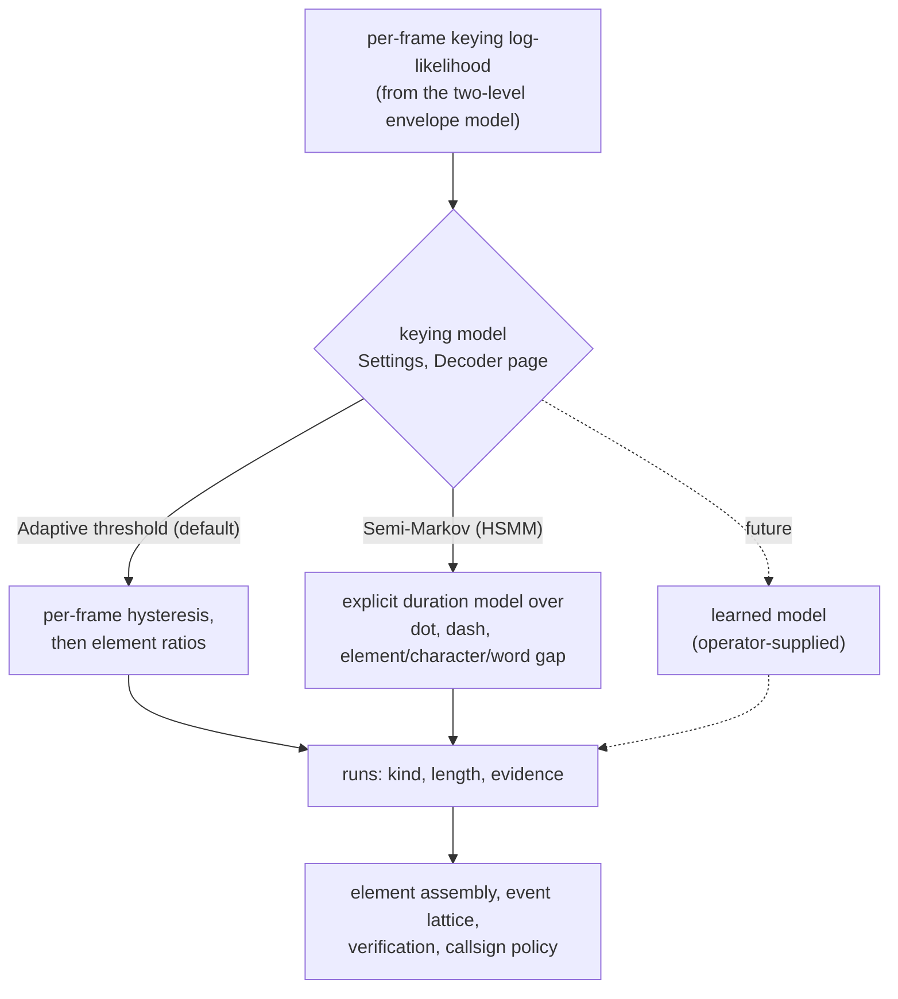
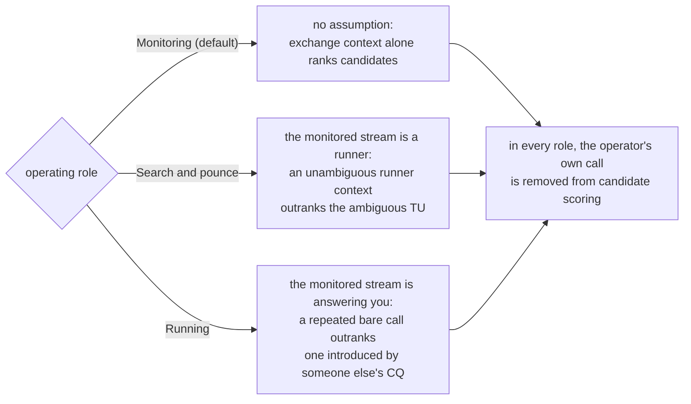

# High-accuracy CW decoder strategy

## Status and objective

This document is the implementation proposal for the complete M2 decoder. A
receive-only full-processed-passband peak tracker and bounded channel bank are
now implemented. Every frequency track owns a phase-continuous complex mixer,
three-stage 120 Hz raw-sample filter, adjacent-band noise references, independent
soft SNR likelihood, adaptive timing decoder, provisional/stable text contract,
stable color, and expiry lifecycle. Sub-bin drift tracking, alternative-width
selection, confidence calibration, and multiple-pass weak-signal recovery
remain planned. Initial bounded multi-speed timing is now
delivered: nine 8–60 WPM paths compete during a provisional acquisition window,
then the selected path adapts continuously and may reacquire after a bounded
transmission gap. The complete decoder's goal
is high weak-signal accuracy with bounded CPU, memory, and latency on ordinary
desktop hardware.
Every claimed improvement must survive the same held-out replay corpus and must
publish its accuracy, latency, false-output, CPU, and memory results.

The recommended design is a confidence-fused hybrid, not a single opaque model.
It retains the observed tone/envelope evidence, exposes uncertainty, and can
fall back to a deterministic decoder when the optional learned model is absent
or unsupported.

## Processing graph

One wide FFT feeds a candidate tone tracker. Each candidate is mixed down
through a narrow multirate filter bank against an adaptive noise estimate to
yield physical narrowband features. Those features drive a deterministic key
likelihood and, optionally, a small causal likelihood model; the two are fused
as calibrated probabilities before a semi-Markov Morse n-best search produces
provisional text, stable text, confidence and evidence. Any context or
callsign re-ranking happens after that and is always labelled separately.

A tracked signal is state, not a dedicated operating-system thread. One FFT is
shared by all candidates and bounded worker-pool jobs process active tracks.
Inactive or low-value tracks do not invoke the optional learned path.

## Selectable keying models

Deciding where the key goes down and comes back up is one stage, and there is
more than one reasonable technique for it. That stage is therefore a selection
rather than a fixed part of the decoder. Everything after it -- element
assembly, the event lattice, the verification gate, callsign policy -- consumes
only the same run description, so a technique is an implementation of one
interface and an entry in one enumeration.

One per-frame keying log-likelihood, produced by the two-level envelope model,
feeds whichever keying model the operator has selected in Settings. The adaptive
threshold decides each frame with hysteresis and classifies elements afterwards
by duration ratio; the semi-Markov model scores whole runs against explicit
duration distributions. A future learned model plugs in at the same point. All
of them emit the same run description -- kind, length and evidence -- which is
what element assembly, the event lattice, verification and callsign policy
consume, so nothing downstream knows or cares which technique produced it.

### Adaptive threshold (default)

Hysteresis on the smoothed keying probability decides key-up and key-down one
frame at a time; a completed run is classified afterwards by comparing its
length against the tracked element length. It is cheap, it emits text with the
least delay, and it degrades gracefully when the sender's timing wanders,
because no single run has to fit a model for the rest to survive.

### Semi-Markov (HSMM)

Dot, dash, and the element, character and word gaps each get an explicit
log-normal length distribution centred on their true multiple of the element
length. A transition *is* a whole segment, scored as the evidence accumulated
across it plus the log density of its duration under that class; accumulated
evidence comes from a running prefix sum, so a segment of any length costs one
subtraction. Because every competing segmentation covers the same frames, their
scores compare directly.

This is what a two-state hidden Markov model cannot express. Giving key-down its
own state and letting it self-loop makes its length geometric -- mode at zero,
no characteristic scale -- so such a model can only be more or less reluctant to
switch, never encode "a mark lasts about one element, or about three".

Two properties are worth knowing before extending it. Morse timing is
self-similar at a factor of three: read three times too fast, every dash becomes
a dot and every character gap becomes an element gap, producing legal Morse of
entirely known symbols that fits its own duration model perfectly. Speed
hypotheses are therefore also scored on how much it costs them to describe the
signal, because a hypothesis three times too fast must break solid marks apart
to make the interval tile at all. Second, silence between transmissions is
unbounded, so word gaps may follow one another; without that, silence longer
than the widest single gap has no legal parse and the search invents marks
inside it to make the interval tile.

### Choosing between them

Neither is better everywhere, which is why both ship. Measured on the keying
style bench at 20 WPM and 20 dB:

| keying style | adaptive threshold | semi-Markov |
|---|---|---|
| machine | **0.117** | 0.242 |
| heavy weighting 1.15 | 0.133 | **0.058** |
| light weighting 0.85 | 0.133 | **0.108** |
| Farnsworth gap 5 | 0.100 | **0.075** |
| jitter 10% | **0.075** | 0.283 |
| jitter 20% | **0.267** | 0.458 |
| bug-like 0.8 weight + 15% jitter | **0.092** | 0.167 |

Lower is better; the figures are mean character error. The duration model wins
where the sender is systematically off the textbook ratios, which is what
weighted keying and Farnsworth spacing are, and loses where their timing
wanders. Hand and bug sending produce exactly that wander, so the adaptive
threshold remains the default. Across the synthetic accuracy surface the two are
level (0.2884 against 0.2946, against a spread of 0.03) and equal on receiver
captures, so the choice is about the sender, not about general accuracy.

### Adding another technique

Implement `CwKeyingSegmenter` (`cw_keying_segmenter.hpp`), add an entry to
`CwKeyingModel`, and add the option to Settings. The interface is deliberately
narrow: frames of calibrated log-likelihood in, committed runs out, plus a score
used to compare speed hypotheses and a state-size report. Note that
`cwEvidenceBoundNats` selects how much per-frame likelihood a model is given --
a per-frame threshold gains nothing past about three nats and is destabilised by
more, while a model integrating across a run gains a great deal.

## First pass: fast causal decode

The always-on path mixes each tracked tone to baseband and decimates it to a
small working rate. A small bank of nearby filter widths provides evidence for
weak, drifting, and slightly mistuned signals without repeatedly computing a
wide FFT. Phase/frequency continuity, robust noise quantiles, and a CFAR-like
threshold produce a probability of key-down rather than a hard on/off decision.

The current measured baseline implements parabolic sub-bin peak interpolation,
a bounded carrier/drift predictor, and parallel 60/120/240 Hz three-stage paths.
Initial acquisition stays at 120 Hz; WPM, drift, local SNR, and a centered-tone
check drive hysteretic selection afterward. Lower and upper noise references
are smoothed independently and combined geometrically so neither one quiet
side nor one adjacent interferer dominates the local threshold. A per-track
responsive two-level envelope model normalizes the keying evidence. A bounded
recent amplitude history regularizes its space and mark levels only when a
robust split has support, at least 6 dB power separation, and at least 70%
explained variation; this supplies separation without the level collapse
measured with plain soft assignment. A bounded 0–1 narrow/wide concentration
metric replaces the former unbounded ratio.

The bounded track bank uses explicit admission control: a strong new carrier
may replace only the weakest unmatched unverified occupancy, never a verified
track. Once a track has enough persistence, an identity-breaking frequency
innovation starts a fresh track rather than transferring decoder history.
The association origin remains immutable except for a known receiver retune.
The adaptive DSP center follows accepted peaks, while a separate display center
is robustly reanchored at first verification and thereafter follows only
sustained coherent, low-dispersion motion through bounded deadband and slew
guards. Display correction never feeds classical association, decoding, or
color leases; the optional narrow character-refinement lane uses this robust
center specifically to reject short DSP-center excursions onto keyed
sidelobes.

Discovery and publication are separate. Broad shoulders fail a local-prominence
test combining a permissive near check with hertz-scaled far references;
surviving tracks move from candidate to Morse-likely only after repeated
spectral persistence, keyed edges, narrowband coherence, and spacing cadence.
At least three known symbols, a bounded recent unknown fraction (30% default), recent
mark-timing quality, and recent mean character confidence then verify the
trace. Passing evidence must remain valid for an entry interval; a longer
failure hold demotes a verified trace, with every gate continuously
re-evaluated. Every pending track has an inspectable rejection reason. These
defaults favor a delayed real signal over immediate false colored lines.
An optional overlap-confirmed local-model callsign can satisfy the final
symbol/timing/character checks for a track that already reached Morse-likely;
it cannot bypass spectral, edge, cadence, coherence, or sustained-entry gates.

Nine fixed 8–60 WPM timing anchors remain active for the entire segment. The
initial leader remains stable for presentation, but every alternative keeps
processing and the best complete path is selected again at silence or flush.
This avoids irrevocable early speed lock without rewriting stable text in the
middle of a transmission. Mid-segment switching remains future work and must
first define an append-only consensus boundary.

Alongside those character paths, a bounded decoder-independent cadence fit
records recent key-down and key-up run lengths. It searches candidate dot
durations from observed marks divided by 1/3 and gaps divided by 1/3/7, scores
them with a clipped robust residual, and reports acoustic WPM plus fit
confidence. It does not use decoded words and does not broadly override the
selected character path. A sustained implausible-character rejection may reset
an unverified timing decoder only when this independent fit confirms regular
Morse cadence; carrier identity, noise tracking, and verified text remain
untouched.

The dependency-free event lattice now receives every immutable key-envelope
mark/gap transition. At completed-gap checkpoints (bounded to at most once per
500 ms) its beam search emits up to four time/observation-scoped acoustic
alternatives. Characters and gap decisions common to all competitive paths are
committed into a separate append-only refinement after sufficient timing
evidence; the primary live transcript is not rewritten. The lattice tracks dit
length, mark/gap duration distributions, character and word spacing, and
manual-keying variance. This gives a low-resource baseline that can explain why
a character was selected and can abstain instead of inventing text.

The primary learned-likelihood path is deliberately limited to acoustic evidence: compare
a causal depthwise temporal convolution network and compact causal recurrent
models. Its inputs are physically scaled narrowband log energy,
phase/frequency error, side-channel contrast, and causal envelope features; it
emits key-down and target-channel-CW probabilities, never characters. The same
explainable semi-Markov timing lattice converts either deterministic or learned
probabilities into Morse alternatives. This keeps timing, UNKNOWN decisions,
stable-prefix rules, and callsign/context policy outside the model and avoids a
second opaque text decoder.

The first experimental vertical slice is implemented as reproducible local
tooling. It generates checksummed synthetic PCM and exact key runs from scratch,
uses profile-grouped train/validation/test splits, trains a small stateful causal
GRU, reports frame calibration plus transition excess and implausibly short
runs, checks streaming ONNX export equivalence, and can infer from resampled
mono PCM16 WAV input. Early experiments proved that aggregate frame metrics can
hide unusable envelope fragmentation, so temporal topology and downstream
character accuracy are mandatory gates. No learned-likelihood artifact is
bundled with the application; the generic optional runtime below carries no
model.
The first target is at most two million INT8 parameters, a bounded state cache,
and CPU-only operation. This is a design budget to benchmark, not a performance
claim. Model choice will be made from the character-error-rate/resource Pareto
frontier rather than architecture popularity.

An additional optional character-refinement boundary is now implemented for
local operator-supplied ONNX models. It does not replace that primary design.
At most four verified, Morse-likely, or manually selected tracks are translated
into independent 30–50 Hz lanes, resampled to a strictly validated feature
contract, and submitted as overlapping eight-second windows to a dedicated
CPU inference thread. Pending work is bounded and coalesced per track, so a
slow model cannot back up capture or DSP queues. Timestamp-aware consensus
accepts only repeated overlap evidence, rejects stale track/frontend
generations, and appends stable text without revising its current generation.

This refinement remains downstream of carrier qualification. Its transcript is
labeled separately and cannot create a track, keep a silent track alive,
replace raw acoustic output, or reach TX. A structurally valid callsign
confirmed by overlapping model windows may complete verification only after
the same track has independently reached Morse-likely through spectral,
keying, cadence, and coherence gates; the ordinary sustained-entry interval
still applies. The confirmed model callsign is shown with explicit provenance. No model
is bundled or downloaded; model accuracy, license, and provenance remain the
operator's responsibility until an independently trained artifact passes the
published corpus gates.

## Multiple-pass weak-signal decode

Ordinary CW does not contain the fixed framing or forward-error-correction bits
of a structured weak-signal digital mode. Multiple passes therefore cannot
create missing information, but they can make better use of observations that a
low-latency causal pass could not yet interpret.

1. **Live pass:** updates element and provisional-character hypotheses with the
   lowest latency. It never waits for a complete transmission.
2. **Rolling refinement pass:** reprocesses a bounded 2–5 second narrowband
   buffer with limited future context, alternative filter widths, nearby tone
   tracks, and competing WPM/timing hypotheses. It may revise only text still
   marked provisional.
3. **Segment pass:** after a word, callsign exchange, or transmission gap, a
   longer bounded segment is rescored in both directions. Acoustic/timing
   evidence remains dominant; QSO or callsign context may re-rank n-best
   candidates but is displayed as a separate inferred suggestion.
4. **Interference-cancellation pass:** for overlapping tracks, reconstruct the
   confidently decoded stronger keyed carrier and subtract it conservatively,
   then retry the residual for weaker signals. The result is accepted only when
   residual and decoding scores improve; the original samples and first-pass
   result remain available.
5. **Optional diversity pass:** when two synchronized receive sources cover the
   same RF signal, align and combine confidence or narrowband evidence. A poor
   source must be rejected rather than reducing the stronger source's result.

The rolling store should hold decimated narrowband samples or features, not a
duplicate full-rate stream for every channel. At 3.2 kHz mono int16, 30 seconds
is about 192 kB per track before metadata; its total size and track count remain
hard-limited. Refinement work runs only inside a configured CPU budget and is
discardable before live capture is allowed to overrun.

## Same-frequency pileup separation

Several callers may occupy the same displayed frequency at a runner station.
They must be modeled as a mixture of operators inside one channel, not as one
malformed keyer. The separator first maintains soft identity fingerprints from:

- sub-bin carrier offset, phase evolution, chirp, and short-term drift;
- WPM plus separate dit, dah, intra-character, character, and word-spacing
  distributions;
- rise/fall shape, key-click signature, element weighting, and timing jitter;
- slowly varying amplitude, QSB trajectory, and receiver-path observations;
- decoded-prefix compatibility only as a separately weighted contextual clue.

A bounded factorial semi-Markov model jointly estimates the key-up/key-down and
timing state of two callers first, expanding to three only when evidence and CPU
budget justify it. The strongest high-confidence hypothesis is reconstructed as
a complex keyed carrier, including its measured envelope and phase trajectory.
Successive interference cancellation then retries the residual, while a joint
beam keeps alternative assignments when operator identities could swap.

The separator is evaluated across relative power, sub-bin frequency difference,
speed difference, cadence similarity, overlap percentage, fading, and number of
callers. Operator lock lets a human seed or retain one fingerprint without
forcing decoded characters. Contextual callsign completion can re-rank an
acoustically plausible alternative, never manufacture one.

There is a physical identifiability boundary: two callers that are simultaneous
and indistinguishable in carrier, phase, envelope, and timing cannot be uniquely
recovered from one mono mixture. In that case the decoder reports competing
hypotheses/unknown intervals. Phase-coherent antennas or receivers can add
spatial evidence, and non-coherent receiver diversity can add independent
fading evidence, but both require measured alignment and a safe single-source
fallback.

### Operator role

Exchange context alone cannot always say which station a call belongs to. `TU`
precedes a runner identifying itself (`TU IU0LFQ`) and equally the station it
has just worked (`TU DL1NKB`), and both score the same, so a run can be labelled
with the station that was worked rather than the one being listened to.

What settles it is knowing what the operator is doing, which is configured under
Settings -> Station:

Monitoring makes no assumption and ranks candidates on exchange context alone,
as the decoder always has. Searching and pouncing, the stream being listened to
is a runner, so a call introduced as the sender's own outranks one merely
mentioned after `TU`. Running, the stream is somebody answering, so a call sent
bare and repeated outranks one introduced by a `CQ` that belongs to another
transmission. In all three the operator's own callsign is removed from candidate
scoring rather than blanked after the fact, so a transmission that mentions the
operator is still labelled with the station actually being heard.

Measured on exactly that ambiguity, `5NN TU DL1NKB OK5OO UP K` labels DL1NKB --
the station just worked -- with no role, and OK5OO, the split runner, when
hunting. Role knowledge changes only which candidate is ranked highest; it never
creates, rewrites, or corrects decoded characters.

### Exchange-role inference

Role inference operates on complete transmission segments and n-best decoded
tokens; it must not concatenate every operator on a frequency into one asserted
identity. It selects an explicit conversation profile rather than assuming all
traffic is a contest. Profiles cover ordinary directed QSOs, general CQ,
DX/pileup, special-event operation, beacons, and contest-specific exchanges;
an unknown/free-text profile supplies no language prior. The following is the
initial bounded runner/pileup state machine, not a universal grammar:

1. a runner solicitation (`CQ`, optionally a contest qualifier, `DE`, a
   repeated self-callsign, or callsign followed by `UP`);
2. a short caller response, usually one callsign repeated once or twice;
3. a runner response containing the selected caller's call plus report/exchange;
4. the caller's report/exchange; and
5. runner acknowledgement (`TU`) followed by the stable runner callsign, `CQ`,
   or another solicitation.

Each segment first receives an acoustic operator assignment from the carrier,
keying-envelope, speed, weighting, spacing, and jitter fingerprint above. Text
then supplies only soft role likelihoods. `DE`, `CQ`, `TU`, and callsign-before-
`UP` strongly support runner self-identification; a standalone repeated
callsign immediately following a solicitation supports a caller; a callsign
followed by a report supports the runner addressing that caller. Reports,
serials, abbreviations, and isolated callsign-shaped tokens never establish an
identity by themselves. Evidence decays over a bounded observation window, but
the recurring runner identity is expected to outscore changing callers.

The marker label represents only a sufficiently supported persistent station
identity. Caller alternatives and their role confidence belong in the decoded
session, not in a rapidly changing marker label. If acoustic assignments swap,
the exchange sequence is incomplete, or two simultaneous operators remain
indistinguishable, the role stays unknown and competing calls remain visibly
provisional. Context can rank acoustically possible hypotheses; it cannot split
an inseparable waveform or replace incorrectly decoded dits and dahs.

Each contest profile is separately versioned from its published rules and
declares exchange fields, legal abbreviations, serial/report formats, role
transitions, and optional operator-editable macros. Ordinary-QSO profiles allow
open-ended name/QTH/rig/weather/conversation text and must avoid forcing it into
a contest exchange. Suggested or automatic replies are a separate guarded
action: exact counterpart identity and current context must be confirmed, the
profile must explicitly enable automation, TX must be armed, the maximum-key-
down and emergency-release paths remain active, and the operator receives a
cancellable preview. Decoder confidence alone never triggers a reply.

## Stable text and uncertainty

Decoder output has three distinct forms:

- **raw evidence:** tone, key-down probability, timing, frequency, and SNR;
- **provisional text:** may be revised by a bounded later pass and is styled as
  uncertain in the UI;
- **stable text:** is append-only once its confirmation delay and confidence
  criteria pass, except for an explicit operator correction.

Every character carries confidence, pass number, time interval, selected track,
and acoustic-versus-context contribution. Low-confidence intervals produce a
visible unknown/alternative rather than a plausible-looking fabrication.
Confidence must be calibrated on held-out data, not treated as trustworthy just
because a model emits a large probability.

Callsign lists and QSO grammar are optional search priors. They never replace
raw text, never turn absence into “invalid,” and never independently authorize
transmission. The operator can disable them immediately from the decoding view.

## Training and test data

The reproducible generator needs exact sample-level labels and domain
randomization over:

- speed, Farnsworth spacing, acceleration, timing jitter, and missing or
  extended elements;
- paddle, straight-key, bug, cootie, and imperfect human timing distributions;
- carrier offset, chirp, drift, phase discontinuity, key clicks, and oscillator
  instability;
- calibrated noise, QSB/fading, AGC pumping, clipping, hum, impulses, speech,
  carriers, adjacent CW, and exact/near-exact co-channel multi-operator pileups;
- receiver filter shapes, sample-rate error, sound-card paths, lossy network
  audio, and SDR demodulator artifacts;
- no-CW hard negatives so silence, noise, data modes, and speech do not create
  convincing text.

Real recordings with clear redistribution rights complement synthetic data.
Training, validation, and test sets must be separated by message, callsign,
operator/keying profile, noise recording, and propagation seed. The acoustic
test set must not gain an unfair advantage from the callsign list used by a
context pass.

## Benchmarks and acceptance gates

The deterministic executable gate (`cwa_decoder_benchmark`) reports character
edits/CER, acquired-WPM error, false characters during a fixed no-CW minute,
processed updates, simulated duration, wall time, real-time factor, bounded
hypothesis count, and a conservative allocated-state estimate. Its cases cover
8, 12, 20, 25, 40, and 55 WPM with fixed weak-SNR and timing-jitter sequences,
plus a 12→40 WPM change across a transmission gap. The state estimate includes
bounded character-evidence buffers and must stay below 256 KiB across this
corpus. The deterministic baseline and acoustic consensus have zero edits on
the 8--55 WPM timing corpus, the consensus repairs the included compressed-gap
callsign case where the conservative primary path retains an unknown, and both
remain append-only across the long-stream truncation case. There are no
speed-limit failures and no false characters in the synthetic noise minute. This is a
regression floor, not the final corpus or a claim of
calibrated over-the-air performance. Separate core regressions drive two
simultaneous original-sample tones through the channel bank, verify independent
decodes and stable identity, and reject an adjacent non-tracked tone. The Qt
pipeline regression verifies that the live DSP worker publishes both a spectrum
frame and a raw-narrowband channel result.

Each experiment publishes:

- character error rate and word error rate;
- exact callsign precision/recall and complete-call accuracy;
- false characters and false callsigns per minute on no-CW recordings;
- weak-signal detection probability versus SNR, always stating the SNR
  measurement bandwidth;
- time to first provisional character, time to stable character, and revision
  rate;
- accuracy by speed, keying style, drift, fading, interference, and number of
  simultaneous signals;
- real-time factor, CPU utilization, peak memory, queue depth, and overload
  behavior on each reference platform.

The benchmark first establishes the deterministic semi-Markov baseline. Small
learned front ends, multi-pass rescoring, and interference cancellation are
then added independently. A feature is enabled by default only when the held-out
gain is repeatable and its resource cost is within the published budget.

## Delivery sequence

1. Build deterministic synthetic/noise fixtures and the benchmark runner.
2. Implement tone tracking, initial raw-sample narrowband evidence, and the
   explainable timing baseline. (Initial path and bounded multi-speed delivered.)
3. Add provisional/stable text and calibrated confidence contracts.
4. Extend the delivered bounded recent evidence and continuous fixed-anchor
   evaluation with safe mid-segment consensus switching and multi-pass
   refinement.
5. Extend the delivered learned-likelihood experiment, compare compact causal
   candidates, and ship one only after receiver character gain, hard-negative,
   license, provenance, checksum, fallback, and resource checks pass.
6. Add conservative strongest-track cancellation and optional diversity input.
7. Add two-source then bounded three-source joint co-channel separation.
8. Add separately labeled QSO/callsign re-ranking and operator controls.

The re-ranking stage operates only after acoustic alternatives exist. Unknown
symbols and uncertain gap boundaries remain explicit lattice branches; a
versioned callsign list can score compatible branches, while a recent
frequency/mode-matched cluster or beacon spot supplies an additional prior.
The UI must preserve the acoustic transcript and identify every proposed
replacement, source, age/version, frequency delta, and score. A database hit is
not acoustic proof, and a cluster spot cannot distinguish two stations sending
on the same mono-audio carrier.

## Research basis

- [Morse Code Datasets for Machine Learning](https://arxiv.org/abs/1807.04239)
  motivates parameterized synthetic data and repeatable evaluation.
- [A CNN/BiLSTM/CTC Morse decoder study](https://jeit.ac.cn/article/doi/10.11999/JEIT190658?pageType=en&viewType=HTML)
  evaluates learned decoding across speed, drift, SNR, and timing variation.
- [A simulation model for CW contest interference](https://arxiv.org/abs/2402.04742)
  supports explicit multi-signal and interference test scenarios.
- [Gain-adapted factorial hidden Markov source separation](https://arxiv.org/abs/1901.07604)
  demonstrates joint temporal inference for two unknown-gain sources in one
  observed channel; its speech result is a methodological reference to test,
  not evidence that CW separation is already solved.
- [Multichannel factorial hidden Markov source separation](https://www.isca-archive.org/interspeech_2014/higuchi14_interspeech.pdf)
  motivates using spatial evidence when synchronized receiver channels exist.
- [Stateful Conformer for cache-based streaming inference](https://arxiv.org/abs/2312.17279)
  describes bounded cached context for streaming sequence models.
- [Efficient Conformer](https://arxiv.org/abs/2109.01163) studies progressive
  downsampling and grouped attention under constrained inference budgets.
- [ONNX Runtime quantization guidance](https://onnxruntime.ai/docs/how-to/quantization.html)
  documents CPU quantization formats and the need to measure accuracy and
  hardware-specific performance.

Public implementation repositories are useful experimental references, but
their self-reported results are not acceptance evidence. CW Buddy will not
import a model, training data, or code until its license and data provenance are
compatible with GPL-3.0-or-later and independently reproduced benchmarks.
