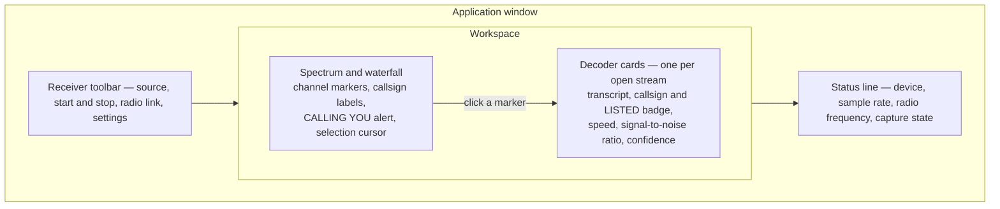
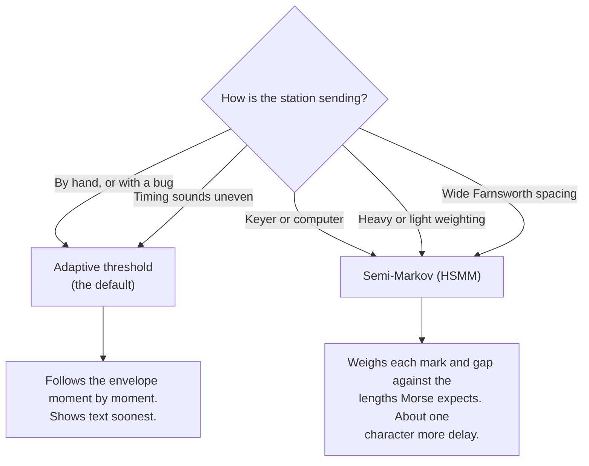

# Operator guide

## Current development status

CW Buddy is pre-release software. The current desktop shell can create and
select isolated station profiles, guide first-time setup, run in receive-only
SWL mode, discover serial ports without opening them, identify online radios
through a supported integration, save radio/keying/display settings, open the Windows
frequency-provider configuration, monitor a CAT4OM radio, process a selected
live sound-card input, and replay a WAV recording through the real spectrum and
waterfall, and run a receive-only decoder across the complete processed
passband. Each tracked frequency now obtains keying evidence from a narrowband
filter over the original audio rather than the display spectrum. Bounded
multi-speed acquisition is active, and the technique that decides keying is
selectable between two: an adaptive threshold, which suits hand and bug
sending, and a duration model that suits machine-sent, weighted and Farnsworth
keying. Weak-signal refinement, direct keying output, logging connection, SDR
capture, and remote-station runtime remain under implementation.
A saved profile does not arm or key a transmitter.

The replay core accepts little-endian RIFF/WAVE PCM at 8, 16, 24, or 32 bits and
IEEE float32. Multichannel input is averaged to mono for this audio-analysis
path. Compressed WAV codecs are rejected with a clear diagnostic.

Every supported-platform build runs an empty-receiver render regression test
and loads the complete QML desktop shell before it can be published. This
specifically covers first launch before a WAV, audio device, or SDR source has
produced spectrum data. The staged application is also launched with the hosted
runner's native graphics path before its installer or archive is uploaded, with
a deterministic test spectrum to exercise waterfall texture creation.

## Where things are on screen



The window is a toolbar above a workspace above a status line. The workspace
holds the spectrum and waterfall on one side and the open decoder cards on the
other; the application opens maximized so both remain usable. Every tracked
signal appears as a marker on the spectrum carrying its
callsign once one is decoded; clicking a marker opens that stream as a decoder
card, which is where the transcript, the callsign and its corroboration badge,
the speed, the signal-to-noise ratio and the confidence are shown. The status
line reports the audio device and sample rate, the linked radio's frequency
where one is connected, and whether a debug capture is running.

Two operators in an ordinary simplex QSO normally alternate on the same
carrier. When the stable text contains a complete `CALL1 DE CALL2` handover,
the one decoder card is labelled **QSO CALL1 ↔ CALL2** and retains both
participants. Sustained silence separates completed transmissions in the card
with `|`. **CURRENT SENDER** appears only when an explicit two-call handover or
`CQ ... DE CALL` identifies the sender; otherwise CW Buddy abstains. It does
not create a second frequency marker or infer a sender from frequency alone.

## Receive live radio audio

1. Open **Settings → Audio**, select the sound-card input connected to the
   receiver, and select **Apply**.
2. In the Receiver workspace, choose **Live audio** instead of **WAV replay**.
3. Select **Start live RX** from either the centre of the empty receiver pane or
   the receiver toolbar. The signal-selection cursor activates only after a
   source starts. On macOS, approve microphone/audio-input access the first
   time; the application requests this only when live RX is started.
4. Confirm the status line names the device and sample rate. Spectrum and
   waterfall frames now come from that device.
5. Select **Stop live RX** before changing cables or audio routing.

Hover over the spectrum or waterfall to see its pointer legend: left-click
opens the decoder card for an already detected stream without changing audio
monitoring, while right-click starts a neutral manual probe at that audio
frequency. The Ctrl+click TX-VFO action is marked unavailable
until the linked provider supports guarded TX-frequency writes. Action buttons
throughout the receiver, settings, setup, and profile views explain their
effect and any disabled state when hovered.

To listen through CW Buddy, choose a **Monitor output** under **Settings →
Audio**, then use the receiver toolbar's **OFF / ALL RX / STREAM** controls.
**ALL RX** passes the complete receiver window without filtering. **STREAM**
stays silent until the operator presses the speaker button in a decoder card.
Each enabled card passes through its own carrier-following narrow filter and is
moved to the configured CW reference tone. Enable several card speakers to mix
several isolated streams; disable the last speaker to return monitoring to
**OFF**. Opening or closing an ordinary decoder card does not start listening.
The adjacent slider
sets local playback level. Monitoring does not change decoder evidence. Output
is intentionally bounded; if the sound device cannot keep up, old audio is
dropped instead of accumulating delay.

Capture requests 48 kHz mono floating-point audio when supported. Otherwise it
uses the input's preferred PCM format, safely averages channels to mono, and
normalizes integer or float samples. Capture places fixed sample blocks in a
bounded queue without allocating or blocking; FFT work runs on a separate DSP
worker. **Input overruns** should remain zero. A rising value indicates the DSP
cannot keep pace and blocks are being deliberately dropped rather than allowing
unbounded latency.

The spectrum and waterfall visualize all audio energy; they do not wait for a
Morse signal. Receiver noise alone should begin filling the waterfall after
live RX starts. If the display remains blank while **Input overruns** rises,
stop live RX and install a newer build because the processing worker is not
draining captured blocks correctly.

## Receive directly from an SDR

An SDR-enabled build can receive complex IQ directly from RTL-SDR, SDRplay,
and other receive-capable SoapySDR modules. It does not require another SDR
application to be running, and another application must not own the same USB
device.

1. For RTL-SDR, install the current official CW Buddy package. Windows, macOS,
   and the portable Linux archive carry their SDR runtime; the Linux `.deb`
   instead makes APT install the distribution's RTL-SDR Soapy module and its
   dependencies. SDRplay requires its compatible vendor API/service and
   SoapySDRPlay3 module to be installed separately. A custom source build must
   be configured with `-DCWA_ENABLE_SOAPY_SDR=ON`.
2. Open **Settings → SDR**, select **Refresh devices** to start hardware
   discovery, then choose the receiver. Startup deliberately does not probe SDR
   hardware.
   If the backend, module, vendor runtime, USB permission, or device is missing,
   the page keeps sound-card reception available and explains what was not
   found.
3. Enter the RF center frequency in whole hertz. Start conservatively at
   250000 samples/s; the device may select its nearest supported rate. Enable
   hardware AGC only when that receiver provides it, otherwise select a manual
   gain.
4. In the Receiver workspace select **Live SDR**, then **Start SDR RX**. The
   spectrum and waterfall use absolute RF coordinates across the captured IQ
   passband and all qualifying CW carriers enter the same independent decoder
   bank used by audio reception.
5. **ALL RX** monitoring is intentionally unavailable for IQ: raw I/Q samples
   are not loudspeaker audio. Open a decoder card and enable its speaker to hear
   that carrier through the narrow, carrier-following CW filter. Several card
   speakers may still be mixed.

This direct-SDR path is receive-only. It exposes no SDR transmit, PTT, or KEY
command. Debug capture still records sound-card audio only; interoperable IQ
recording is tracked separately. If a current official package reports the
SoapySDR backend unavailable, the installation is incomplete or damaged. If
the backend is ready but no receiver appears, check the USB connection,
platform device access, and the device-specific module/vendor driver. Linux
users may need to reconnect the receiver after installing device-access rules;
the portable archive cannot supply kernel drivers or grant USB permissions.

If a stationary peak fills the far-left edge, open **Settings → Audio** and
leave **Remove input DC offset** enabled. This is normally sound-card DC bias,
not gain. Keep **Automatic gain** off for a calibrated receiver and tune
**Manual gain** from 0 dB; or enable it and choose the automatic dBFS target.
Use automatic 100–3000 Hz bandwidth for a general CW view, or disable it and
enter lower/upper frequencies around the receiver passband. Select **Apply** to
save the values in the active station profile.

The same operational controls now sit immediately below the spectrum. Changes
to DC rejection, software gain, bandwidth, display levels, automatic span, and
waterfall noise suppression take effect while RX is running. **Save profile**
persists the current values; the Settings pages remain available for complete
profile configuration. The panel collapses to a slim header when the pointer
leaves it; hover over the header to reveal it, or select **Pin** while making
several adjustments.

The waterfall always represents the selected fixed number of **History**
seconds from top to bottom. At startup, unavailable older time stays dark rather
than stretching the first received rows over the pane. Resizing changes only
the pixel height, and capture gaps remain visible as dark time. Display
controls do not change what is decoded: **Avg** is a presentation setting only,
and any **Lines/s** value of 60 or more supplies the decoder with identical
evidence. Below 60 lines/s the detector receives fewer spectrum observations
and may acquire a signal more slowly, so prefer 60 or more while decoding.
Adjusting these controls no longer restarts decoding either — only changing the
processing bandwidth, DC rejection, or gain resets tracks and transcripts.
**Lines/s**
controls genuine overlapping analysis updates without changing the window
duration; use 60–120 lines/s when inspecting high-speed dit/dah traces, subject
to available CPU. Reduce **Avg** to 1–2 frames for crisper element edges; raise
it only when a steadier but less time-sharp display is more useful.

For timing inspection, select **CW symbols**. Unlike **Audio spectrum**, this
is intentionally sparse: only active, verified channels' carrier-on states are
drawn as high-contrast marks on a neutral background. Carrier-off rows form
blank gaps, and full-passband/unverified noise remains exclusively in Audio
spectrum. A retained marker cannot draw marks unless its peak is currently
matched, so residual noise during the identity hold stays blank. This makes
dit/dah timing readable rather than presenting a second noise spectrogram.

The Display controls are grouped into multiple responsive rows. Drag the
labeled sliders for FPS, line rate, averaging, history, levels, CW center/width,
and Audio-spectrum noise margin; each label shows the current numeric value.
The full Settings → Display page offers the same slider interaction.

Enable **Visual guide** to draw two dashed red boundaries around the desired
receive region. Their positions are exactly the configured center minus/plus
half the configured CW width. The default is centered at 700 Hz with a 200 Hz
width; both values update in real time and are stored per profile. The region
has no fill, so it cannot be mistaken for an identified signal — that treatment
is reserved for active verified CW tracks (see below). This guide is visual
only: it does not select a decoder, limit decoding, change receiver tuning, or
change decoder bandwidth.

Right-click an unmarked spectrum or waterfall trace to create and immediately
open a neutral manual decoder region at that audio frequency. This does not
move the independent red CW guide. As measured carrier evidence shifts, the
region follows it through the same bounded, smoothed tracker used by automatic
streams rather than remaining frozen at the clicked coordinate.
The slice uses real narrowband evidence but does not claim that the signal is
CW: its text and callsign remain hidden and it is excluded from the detected
count until the normal cadence, timing, symbol, and coherence gates pass. A
verified region becomes the ordinary colored stream with the same session; an
unverified region expires after the configured **Decoded stream timeout**.
Click again to refresh it. Manual
centers within 12 Hz reuse the slice, while more distant centers can remain
separate for close pileup inspection. Radio retuning remains a separate,
capability-checked operation rather than a consequence of this click.
Left-click remains reserved for opening an already detected colored stream.

For a quieter waterfall, open the **Display** live-control tab, leave **Suppress
noise** enabled, and start with a 6 dB margin. Automatic levels maintain a
minimum 60 dB span and follow falling peaks slowly, preventing receiver-noise
changes from repeatedly driving the palette yellow. A radio's own AGC may still
change the audio level delivered by the sound card; this application does not
yet control radio AGC through CAT.

The receiver scans every frequency inside the processed audio bandwidth for
both live audio and WAV replay. Spectral peaks begin as private candidates and
do not immediately receive a line. A candidate must show local prominence,
repeat across spectrum observations within the retained track, contain coherent
narrowband energy and keyed edges, and progress through a Morse-likely state. It
then must
produce at least three known Morse symbols with bounded unknown output plus
adequate spacing cadence, timing, and character confidence. Only then does
it receive a stable color and a colored vertical area with a fixed 120 Hz
presentation width, or increment **signals detected**. The internal adaptive
filter remains independent and is reported in the tooltip/session diagnostics,
so its normal 60/120/240 Hz changes cannot resize or flicker the marker. A
thinner line inside that area flashes
with the live keying state. Click anywhere in that colored area to open its
decoded session in the right-hand panel. Its larger decoded-text window wraps
the latest output and follows new text while its viewport is at the bottom.
When a stream contains **Settings -> Station -> Own callsign**, its marker on
the spectrum blinks and reads **CALLING YOU** in red. That happens on the
spectrum rather than only inside an opened decoder card, because the point is
to find the stream in the first place; click the marker to open it and follow
the decode. The operator's own callsign is never used as a stream label either:
hearing it means somebody is calling, and the station worth naming is the one
doing the calling, so the stream stays unlabelled until that station
identifies.

A confirmed callsign shows whether the offline list corroborates it. In the
decoder card a green **LISTED** badge with a tick follows a callsign found in
the list, and a plain **DECODED** badge follows one that was not; on the
spectrum, a corroborated callsign is drawn as a solid chip and carries a tick.
Neither badge appears when no list is loaded. **DECODED** is not a warning: a
station that is simply absent from the list is ordinary, and the badge reports
corroboration rather than correctness.

When the offline callsign list is loaded, a decoded callsign that is within
two characters of a single entry in it can be suggested in place of what was
decoded. That substitution is off until enabled in **Settings -> Decoder ->
Correct near misses**, directly below the callsign-list controls. It is
unavailable until either the managed cache or an operator-supplied list has
loaded successfully. Two listed stations can differ by one character, so a
correction can name a station that was never sent. Enabled or not, the
suggestion stays advisory: it never rewrites the transcript, never becomes the
confirmed callsign on its own, and never affects verification.

Pending updates are reported once per launch. If a newer application build or
a newer callsign list is available, a notice lists them with a button for each;
nothing is downloaded until it is pressed, and the notice waits until any
first-run profile or setup step is finished. For an application update, the
notice then shows download and checksum status and replaces the download
button with **Open Installer** and the platform reveal action after successful
verification.

Scroll upward or select text to inspect earlier output without live updates
moving the cursor or viewport; scroll back to the bottom to resume following.

## Guarded TX preparation

Open **QSO** to use guarded direct serial CW transmission. Before **Arm TX** can
be used, all of the following must be true:

1. **Settings → Keying** names a dedicated serial port, assigns separate PTT
   and KEY lines, and uses an electrically verified active-high interface.
2. Physically disconnect the radio, fit RTS→CTS and DTR→DSR loopbacks, select
   the disconnected confirmation, and press **Run measured loopback**. CW Buddy
   must observe the inactive baseline, each independent transition, and the
   final release. Changing any keying detail invalidates the stored result.
3. The radio-control provider confirms the exact TX frequency, split state,
   and a CW or CW-R TX mode. A target that the provider cannot read back is not
   sufficient to arm.
4. Your own callsign is configured under **Settings → Station**.

Arming opens the named keying port in its inactive state and snapshots the
confirmed radio state. A later TX-frequency, TX-mode, split, port, line, or
polarity change disarms before keying; a change observed while KEY/PTT is active
causes an emergency release and latched fault.

Choose **TX** on a decoder card whose callsign was decoded exactly. Retype that
station before preparing **Send my call**, the editable report/exchange, a
profile-configured quick macro, or operator-authored free text. CW Buddy
normalizes the message to uppercase
Morse-compatible text and shows its duration at the selected 5–80 WPM; retype
that exact preview as a separate confirmation. **Transmit confirmed message**
then schedules the immutable Morse plan on the direct adapter. **Cancel
transmission** and **EMERGENCY RELEASE** synchronously release KEY before PTT;
emergency release also latches a fault and requires an explicit reset.
While active, elapsed/remaining time and progress come from the worker's
monotonic schedule rather than an optimistic UI timer and clear on completion,
cancellation, or fault.

For initial hardware acceptance, connect the transceiver to a dummy load, use
minimum power, keep an independent means of removing power available, and
verify a message, cancellation, watchdog release, and emergency release before
any on-air use. The measured serial loopback proves only the selected control
and sense paths; it does not certify the radio interface or replace this
dummy-load acceptance.

**Auto-QSO suggestions** only prepares an operator-visible suggestion when the
selected stream contains a listening cue such as `CQ`, `QRZ`, or `UP`, or when
your exact callsign is decoded. A callsign within two edits of yours must appear
twice in the raw acoustic transcript before it can propose repeating your call.
It never arms, confirms, retunes, or keys.

When the selected card has checked live-radio RF context, **Anchor runner at
700 Hz** (or the profile's configured CW reference) explicitly retunes RX so
that station lands on the guide. TX frequency, split, and mode are not changed.
For normal `UP` operation, callers then appear at higher audio frequencies to
the runner's right. The control is unavailable for WAV/AF-only streams or a
read-only/unlinked provider. It is not yet a quiet-slot TX selector.
**EMERGENCY RELEASE** clears pending transmission state and latches a fault;
resetting that fault leaves TX disarmed.

**TUNE** is an armed, operator-only PTT/KEY toggle: press once to start and
again to release. It cannot be restarted to extend the interval and releases
automatically at the independent 15-second hardware deadline. The Radio
Control and QSO controls invoke the same guarded action. Decoder output and
Auto-QSO suggestions have no route to TUNE or direct keying.
New characters are appended to the existing text rather than replacing it, so
the view stays where it is instead of shifting as each one arrives, and when
the transcript is following the tail it stays pinned to the bottom in the same
frame the text grows. The transcript remains plain text so incoming characters
cannot cause styled text or scrollbar-driven line reflow. Short content fills the complete
transcript viewport instead of leaving a differently sized inner box; longer
content grows vertically inside the same scroller. A confirmed remote callsign
is bold and shown in the card header using the stream color. A completed
two-callsign handover shows both participants in that header. The guarded TX
button includes the exact callsign it will select, so a two-party card never
hides the target behind an ambiguous generic **TX** label. If
stable text contains an exact match for **Settings → Station → Own station
callsign**, the card displays **YOUR CALL HEARD** and its border flashes five
times. This notification is visual and receive-only;
it never arms or starts transmission. The session remains selected if the same frequency/color is
reacquired under a replacement tracker ID. Up to 2,048 stable text characters
remain visible across that replacement, but the confirmed callsign is cleared
until the replacement's own acoustic suffix establishes it. The prior
transcript is carried forward once rather than
being appended repeatedly during live refreshes. Simultaneous nearby decoded
signals keep separate cards and colors; only a later return after the previous
track has ended inherits that track's retained identity. Closing a card with **×** does not
stop its DSP; click the marker to reopen it. Drag the card's handle to set the
preferred order, or focus the handle and press Up/Down for keyboard reordering.
The card prefers
the append-only phase/timing consensus once it has stable content and uses the
literal greedy decoder only while that consensus is unavailable. This makes
compressed manual character and word gaps easier to read. Its newest roughly
one second remains provisional until at least six later mark/gap observations
support it; a brief detector dropout therefore does not freeze a premature
guess, while sustained silence still closes the transmission. Callsign labels
compare the literal and refined paths: shared evidence wins disagreements, and
splitting a prosign from a call-shaped fragment is not sufficient by itself to
create a label. Stable text, amber
provisional text/elements, adaptive WPM, SNR, confidence, drift, and selected
filter width update in place. Competitive acoustic timing paths remain
available for callsign selection and debug capture; they are not appended as a
second competing transcript.
A completed turn may display conservatively reconstructed word boundaries, but
only when an acoustically competitive path contains exactly the same decoded
non-whitespace characters. Context never changes a letter, digit, punctuation
mark, raw transcript, phase-consensus transcript, callsign confirmation, or CW
verification decision. The current-sender label and its WPM appear only after
strong handover evidence; bare or repeated calls and an isolated `DE CALL`
fragment are intentionally insufficient.
A keyed gap does not immediately discard a track; decoded tracks are retained
for a configurable timeout (Settings → Display → **Decoded signal timeout**,
default 30 seconds, configurable up to 300 seconds) so normal word and message
gaps preserve identity. Silence retains rather than invalidates the verified
observation. The filled area and center line clear
while inactive, leaving a short horizontal identity-color mark on the frequency
axis. The stream label is 18 px normally and magnifies to 32 px while the marker
is hovered.
Retention preserves identity and text only: without a current matched peak it
cannot keep the area active or generate CW-symbol rows from residual noise.
Spectrum association and decoder input bridge ordinary word gaps for 750 ms.
After that unmatched interval, the decoder forces key-up, drains its pending
acoustic segment once, and stops accepting narrowband audio until a candidate
at that carrier is matched again. This alone is not a transmission boundary:
on reacquisition, only the longer sustained-silence rule completes a turn, so
a slow operator's ordinary word gap is preserved. This prevents residual energy or a nearby
station inside the analysis-filter skirt from extending the retained
transcript. The filled area clears at the same boundary. This hold is
independent of the longer six-second verification-exit and configured
marker-retention timers. At first verification the marker corrects an initially
biased acquisition from recent consistent carrier measurements. It then
follows only sustained, coherent carrier motion slowly; short peak jitter,
nearby signals, silence, and noise cannot move it, resize it, or change its
retained color. The label grows to 32 px on hover.
If the marker eventually expires, its carrier keeps
the same reserved color for at least five minutes and reuses it when recognized
again; a new track ID therefore does not make the same frequency look like a
different station merely because one pass ended.

Peak shape is measured in hertz rather than a fixed number of FFT bins. A small
near-shape requirement rejects broad shoulders, while farther references allow
the wider peak produced by a real receiver/audio path to enter private
tracking. Therefore a visible narrow trace may take several characters before
its marker appears, but a steady carrier or broadband level change should not
be presented as a decoded station. A genuinely broad spectral feature
(adjacent SSB audio, AGC pumping, a receiver-filter skirt) is expected to
never appear as a candidate at all, because its shape fails the
local-prominence check before any track is created.

Frequency text is written vertically beside the matching colored area inside
the upper spectrum region, never over waterfall history. Until a callsign is
confirmed the label contains only its frequency; the confirmed callsign then
replaces it. Callsign text remains
hidden until the track is verified, the decoder has promoted the text to stable,
a word gap confirms that the structurally valid token is complete, and decoded
exchange context (`DE`, `CQ`, `TU`, `UP`, `PSE K`, `K`, `KN`, `AR`, or `SK`)
or exact repetition supports it.
The candidate may come from the literal path or the append-only acoustic
consensus, but it must pass the same context/repetition policy. This is
signal/timing and text-context evidence, not external directory validation. The marker
tooltip exposes the same confirmed call, frequency, audio tone, filter width,
and measured drift.

The FFT-bin tracker discovers candidate frequencies, but it does not provide
the key-up/key-down evidence. For both live audio and WAV replay, the DSP worker
uses the original samples to mix each tracked tone to baseband, evaluates
three-stage 60, 120, and 240 Hz paths, compares their energy with independently
smoothed references on both sides, and supplies new soft evidence 500 times per
second to that track's adaptive timing decoder. The 120 Hz path remains fixed
during initial acquisition; the decoder can then narrow a clean slow signal or
widen a fast/drifting signal. This is deliberately independent of spectrum averaging,
waterfall levels, display gain, and the 700 Hz visual guide.

Each new track evaluates nine timing starts from 8 through 60 WPM. During at
least the first 2.5 seconds after keyed evidence begins, the best current path
is intentionally shown as amber provisional text because it may change as
slower hypotheses gain enough evidence. After the timing score and
decoded-symbol threshold pass, one path becomes the presentation leader while
all nine fixed speed anchors keep processing. A gap of at least 2.5 seconds
reselects the best complete path, preserves stable text, and starts a fresh
speed acquisition, so an early choice cannot permanently disable alternatives
and another sender can use a substantially different speed. Quality is judged
over bounded recent evidence, allowing a rough acquisition to recover. Short
or ambiguous fragments may remain provisional rather than being presented as
certain.

In parallel, a bounded timing lattice uses shared cadence evidence to revisit ambiguous dit/dah and
character/word-gap boundaries every 500 ms and at completed gaps. It retains at
most four competitive acoustic paths. Only a common prefix with sufficient
evidence crosses the append-only boundary during continuous reception. At an
explicit completed-transmission boundary, the best bounded path finalizes a
remaining ambiguous suffix instead of losing it. This specifically helps
manual keying and compressed spacing; it cannot reconstruct two exactly co-channel stations
whose simultaneous marks have already merged into one envelope.

A colored verified marker is intentionally delayed until the complete evidence
set remains valid for roughly half a second. Brief fades then receive a longer
hold before removal, reducing both transient false markers and visible flapping.
No-signal evidence cannot demote a verified marker before the configured
decoded-signal timeout; contradictory evidence from an active carrier can.
Cadence, pure timing, and blended character confidence remain separate gates;
one strong metric cannot substitute for a failing one.
An extremely short fragment can therefore end while still provisional; this is
an abstention, not evidence that its carrier was absent from the symbols view.
Development builds also preserve the final verification summary when the
hosted live-audio acceptance fixture fails, so a release is not advanced on an
opaque or unexplained decoder result.

Element timing is measured without a length bias. The keying decision is taken
in the linear power domain from separately measured space and mark levels. A
responsive tracker follows fading and manual weighting, while a bounded recent
history anchors it to robust low and high populations only when they are
clearly separated; a broad noise population cannot supply that anchor. This
keeps ambiguous keying-edge samples from pulling both levels together. The
smoothing applied before the decision scales with the element length being
tracked rather than being fixed. In practice this removes the strong speed
dependence the decoder used to have and improves the generated speed/noise
surface, but it does not make every field transcript correct. The element
length is measured from a mark together with the
gap that follows it, whose combined length does not depend on how heavily the
operator weights their sending, so bug and hand-key styles are no longer
penalised the way they were. The separately displayed/per-sender acoustic WPM
uses the same paired-duration principle, but filter width and decoded
characters retain an independent mark/gap timing estimate. This prevents a
better speed readout from silently changing text or publishing a different
callsign. Weak signals below roughly 15 dB remain
unreliable, very light machine weighting is slightly worse than heavy, and
speeds near 50 WPM are currently limited by the narrowband filter width rather
than by timing.

The baseline handles letters, digits, common punctuation, selected prosigns,
sub-bin drift tracking, and automatic filter width selection, but does not yet
provide calibrated confidence, multiple-pass weak-signal recovery, or separation of
callers occupying the same frequency. Signals closer than about 45 Hz may
therefore appear as one track, and noise or non-CW
carriers may produce `?` or incorrect text. Changing the audio source or
processing bandwidth clears decoder state. Decoder output cannot arm TX, key a
radio, or initiate a QSO.

Development tooling includes an experimental independently trained acoustic
likelihood model, but released applications do not load that model yet. The
live primary path continues to use the deterministic narrowband envelope and
timing decoder. A learned likelihood model will be enabled only after it
improves locked receiver recordings at character level, preserves no-CW safety,
fits the CPU/memory budget on every packaged architecture, and keeps the
deterministic path available as fallback.

Builds with the optional local character backend can additionally run an
operator-supplied ONNX character model selected under **Settings → Decoder**.
The application supplies no model and performs no download. Once enabled and
validated, up to four verified, Morse-likely, or manually selected tracks are
refined on a CPU worker. The card shows delayed append-only output in a separate
**LOCAL MODEL** block. Strong characters normally require two overlapping
eight-second windows; a moderate-confidence character needs three aligned
windows and remains provisional with only two. Deterministic text remains
separate. A
structurally valid call confirmed across overlapping model windows may complete
verification after the carrier has independently passed the ordinary spectral,
keying, cadence, and coherence checks and the sustained-entry interval. It then
appears in the header with a **MODEL** badge. Model output cannot create a
carrier, keep silence active, replace raw text, or initiate transmission.

Treat `?` as retained acoustic uncertainty, not as a character that a directory
has disproved. Settings → Decoder can use an operator-selected offline
`master.scp`/Call History file or an optional managed `MASTER.SCP` copy
downloaded directly from the Super Check Partial (SCP) Database. Managed use
and automatic checking are independently switchable. Automatic checks run at
most daily and download only a changed release; **Check for updates** starts an
immediate operator-requested check. The last valid copy remains usable offline
and is preserved after any network, validation, or write failure. SCP is an
activity-derived contesting aid maintained by W9KKN, not an official callsign
register, and is not bundled with CW Buddy.

If at least two current competitive acoustic paths agree on the same strongest
complete callsign, and it is within two wildcard-aware substitutions,
insertions, or deletions of a completed uncertain call-shaped span, the
marker/card may show `≈ CALL`. An exact list hit carries a **DB** badge; if the
stronger acoustic winner is absent from the list it remains visible as
**AUDIO** instead of being displaced by a weaker database candidate. Ambiguous
evidence causes abstention. The
approximation sign is intentional: the transcript remains unchanged, and the
suggestion cannot confirm the callsign, verify a stream, trigger the own-call
alert, or control transmission. Acoustic alternatives remain
available in diagnostic capture, while the card
shows the deterministic phase/timing consensus when available and falls back
to the literal acquisition path otherwise. A future online callbook, activity
list, or cluster spot must preserve the same separation and provenance.
**AUDIO** suggestions remain available without downloading a callsign list;
the list only changes the badge to **DB** when it independently contains the
same acoustic winner.

## Choose the keying model for the sender

**Settings → Decoder → Keying model** selects how the decoder decides where the
key goes down and comes back up. Two are available, and neither is better in
general — they suit different senders.



Choose by how the station sounds. Hand and bug sending has timing that wanders,
and the adaptive threshold copes with that far better — roughly three to four
times fewer character errors on a signal with ten per cent timing jitter. A
keyer or computer sends to a machine's timing, and a station using heavy or
light weighting, or wide Farnsworth spacing, is systematically off the textbook
ratios rather than random; the semi-Markov model handles that better, roughly
halving character errors on heavy weighting.

If you are not sure, leave it on the default. On general accuracy across speeds
and signal levels the two measure the same, so the choice is only worth making
when you can hear what kind of sending it is.

You can switch while a station is still sending. The decoder restarts but the
stream, its colour and its history are kept, so you can hear the same station
under both and keep whichever reads better.

## Tell the decoder what you are doing

**Settings → Station → Operating role** tells the decoder whose callsign a
stream is expected to carry. It matters because the text alone is sometimes
genuinely ambiguous: `TU` comes before a runner identifying itself, and equally
before the station it has just worked.

- **Monitoring** — the default. No assumption is made; the exchange text alone
  decides.
- **Search and pounce** — you are hunting stations that are calling. The station
  you are listening to is a runner, so its own call is the one shown.
- **Running** — you are calling and others answer, so the stream is somebody
  answering you.

In every role your own callsign is never used to label another station's
stream, so a station calling you is still labelled with *its* call rather than
losing its label. Your call being heard is separate and still raises the
**YOUR CALL HEARD** notification.

The role only changes which candidate is chosen as the label. It never changes,
corrects, or invents the decoded text itself.

## Debug capture

When a visible signal will not decode and the on-demand **Diagnostics**
readout is not enough to explain why, use **Debug capture**, in the decoder
panel header or under **Settings → Decoder**. It is only available while live
RX is running. Selecting it
starts a bounded recording:

- The exact raw audio feeding the decoder, written to `audio.wav`.
- A private per-track diagnostic log, `diagnostics.jsonl`, with one line per
  second listing every currently tracked frequency — including tracks that
  never become visible — with its SNR, narrowband coherence, filter width,
  verification state and reason, spectral observations, key transitions,
  decoded/unknown symbol counts, timing/cadence quality, WPM, both provisional
  and stable decoded text, and the presented callsign with
  phase-consensus/literal/retained provenance. Capture context states whether
  decoder tracks existed before recording began. Presentation diagnostics show
  local-model/offline-database state and each callsign suggestion or its
  rejection reason. Completed transmission turns, explicit current-sender
  evidence, and its supported cadence estimate are included as separate fields.
  Each line also records the linked radio's RX/TX frequency
  and split state at that instant, so reviewing the
  file shows whether (and exactly when) the VFO moved during the capture —
  a common explanation for a signal that stops decoding partway through.

Both files are written to a timestamped folder under the application's
standard per-user data location; the panel shows the exact path while
recording and after it stops, and **Settings → Decoder** has an **Open capture
folder** button that opens it in your file manager. Capture stops itself after
the **Stop automatically after** value in Settings (30 to 1800 seconds, 300 by
default) and always requires an explicit click to start; it is never silent or
automatic. Select **Stop capture** to end it early. Raise the limit for a signal
that only misbehaves occasionally; lower it for a quick reproduction, so there
is less to review before sharing. Because the WAV file is exactly what the
selected audio input picked up, review its contents before sharing the
capture folder with anyone.

## Replay a receiver recording

1. Choose **WAV replay**, select **Open WAV**, and choose a local recording.
2. Review the detected filename, sample rate, and duration.
3. Select **Play**. The upper trace is the current Hann-windowed FFT; the lower
   panel is the scrolling waterfall. Select **Audio spectrum** for smoothed
   spectral history or **CW symbols** for crisp verified-channel acoustic
   dit/dah/gap rows on a neutral background. The symbols view is keyed envelope
   evidence, not reconstructed decoder text.
4. Use **Pause** to retain the current display or **Stop** to return to the
   beginning. Opening another file clears the previous display.

The progress bar and elapsed time follow sample-derived recording time rather
than wall-clock guesses. The first integration does not yet provide seeking or
looping. Frequency labels cover 0 Hz through half the WAV sample rate because
ordinary WAV replay is treated as real-valued audio, not complex I/Q.

When a transmission ends, the decoder may compare the completed mark/gap
sequence against the other timing speeds it was already tracking. It adopts an
alternative only when the acoustic fit improves clearly, extends already
committed text cleanly, and no near-tied physical interpretation disagrees.
This can correct a bad early speed lock, but it does not rewrite text while the
station is still sending and it does not use a callsign database or conversation
guess to manufacture characters.

Debug captures record a `timingFingerprint` for each completed turn when its
retained mark/gap sequence is complete and contiguous. It summarizes physical
timing only; a missing value is reported as unavailable, and a present value
does not identify an operator or confirm a callsign.

Open **Settings → Display** to select the redraw target, waterfall row rate,
automatic or manual dBFS range, DSP averaging from 1 to 32 frames, and the
profile-persisted spectrum view. Switching views while live or replaying does
not reset the decoder. Automatic range uses a smoothed robust estimate so an isolated
strong bin does not repeatedly rescale the entire view. These values are saved
independently in each station profile.

## About and author

Open **Settings → About** to see the application version, license, author, and
author website. The displayed author is **Alessio Bravi (IU0LFQ / AD2FC)** and
the **Author Website** button opens [https://iu0lfq.it/](https://iu0lfq.it/) in
the system browser. The application, taskbar/dock entry, and installed shortcuts
use the same Morse-key dot/dash mark.

Continuous downloads are published only after every supported-platform build,
test, staged-layout check, and native startup smoke test succeeds. A failed
matrix does not replace the last fully verified download.

The displayed version is the same `major.minor.revision` value embedded in the
native installer/package and application metadata. Continuous builds use the
GitHub workflow run number as the revision, so a hosted build may show, for
example, `0.1.245`; a default local development build shows `0.1.0`.

## Checking for updates

The same **Settings → About** page checks for updates. A background check
runs a few seconds after every launch (uncheck **Automatically check for
updates** to disable it), and **Check for updates** runs one on demand,
showing when it last ran and whether a newer version is published.
During the short interval in which continuous-release files are being replaced,
the previous manifest remains available and the application retries transient
404, timeout, and server errors. A persistent failure is still reported after
three attempts; it is never treated as an available or verified update.

When an update is available, **Download update** fetches this platform's
installer/package to your Downloads folder and verifies its checksum against
the published `SHA256SUMS` before keeping it — a failed or mismatched
download is discarded automatically, never silently kept. Once verified,
**Open Installer** and the platform-specific reveal action replace **Download
update** in the same action row. The startup update notice follows the same
sequence: it shows download and checksum-verification status, then replaces
its download button with **Open Installer** and the platform reveal action
without requiring you to find the About page. **Open Installer** hands it to
the OS's own
installer or package manager
(the Windows MSI installer, the Linux package tool, or an archive tool on
the portable builds) so you complete the install the normal way; **Show in
Finder**, **Show in File Explorer**, or **Show in Folder** reveals it instead.
The application never downloads or installs an application update without you
clicking these buttons, and never silently replaces itself while running. This
is separate from an explicitly enabled callsign-database refresh, which only
replaces its validated local data cache.

## First launch

1. Start `cw-buddy-desktop`.
2. Enter a descriptive station profile name, such as `HF desk` or
   `Satellite station`.
3. For audio-only decoding, select **No radio — receive-only audio decoding
   (SWL)**. The wizard skips CAT and Keying after the Audio step.
4. For radio operation, select a positively identified online radio. On
   Windows, the initial detector reads the online state and model name from the
   installed OmniRig service; it does not send probe commands to arbitrary COM
   ports.
5. If the radio cannot be identified, select **Set up a radio manually**, choose
   the nearest reference template, then edit every value to match the radio and
   cable.
6. On **Audio**, select the sound-card input carrying receiver audio. **System
   default input** follows the operating-system default when devices change.
   This step is always present for radio and SWL profiles. For a controlled
   radio, also confirm **This input carries RX audio from this radio** if the
   selected device is physically connected to that receiver.
7. Select a physically separate direct-COM key/PTT interface. Port enumeration
   never toggles RTS or DTR.
8. Review the display defaults and finish the wizard.

The Back and Next controls live in a fixed wizard footer and remain visible when
a setup page must scroll on a small or scaled display.

Finishing the wizard saves settings only. Hardware ownership, a keying loopback
test, and the transmit guard will be required before transmission is enabled in
a later milestone.

Selecting SWL mode persists that choice per profile, disables radio/keying
validation, and labels the workspace as receive-only. Previously entered radio
values are retained so switching the profile back to radio operation does not
discard configuration.

The current build discovers, displays, and saves audio-input selection, including
an unavailable marker when a previously selected device is disconnected. Live
sound-card capture, input level metering, channel/sample-rate selection, and
buffer controls are still under implementation; use **Open WAV** for the active
signal-processing path in this build.

## Multiple radios and application instances

Create one named profile for each independent station chain. If more than one
profile exists, the startup helper asks which profile to open. A shortcut or
automation can bypass the helper:

```text
cw-buddy-desktop --profile "HF desk"
cw-buddy-desktop --profile "Satellite station"
```

Two application processes may use different profiles. Future device locks will
prevent both processes from opening the same serial, audio, or SDR device.

## Frequency, split, and transverter terminology

- **RX dial frequency** is the frequency reported to or requested from the
  radio for reception.
- **TX dial frequency** is independent when split is enabled.
- **RX/TX transverter offset** is a signed integer in hertz. It is used to
  calculate actual RF for display and logging; the offset is never sent to a
  direct CAT radio by accident.
- **CW audio-to-RF mapping** selects CW-U/USB or CW-L/LSB direction. For a live
  linked input, each signal is calculated as `actual RX RF + direction ×
  (decoded audio tone − configured CW pitch)`.

Actual-RF marker labels are enabled only while live capture is running, the
profile explicitly links that audio input to the radio, and the selected
frequency provider has a valid state. Windows OmniRig is polled for its online
state, Hamlib publishes only complete rigctld polls after verifying `--vfo`,
and CAT4OM uses its pushed radio state. The RX transverter offset is
applied before tone mapping. Recordings, SWL profiles, unlinked inputs, and
unavailable frequency providers deliberately show **AF** rather than guessing.

The **Radio Control** panel shows the resolved radio state as a compact faceplate
above the signal list: grouped whole-hertz RX and TX digits, a dim/red ON AIR
area, explicit VFO and SIMPLEX/SPLIT state, provider-reported RX mode, a
separate CW/CW-R operator TX target, and an orange TX frequency. Unknown
frequency, split, VFO, or observed mode state is shown as unavailable; CW Buddy
never manufactures a simplex value or derives observed radio state from its
audio decoder. The faceplate disappears
entirely for receive-only SWL setups, WAV replay, and whenever no radio is
currently linked, rather than showing a stale or meaningless value. Note
that showing this readout at all requires **both** Settings → Radio
**Radio enabled** and the **audio input linked to radio** toggle — enabling
the radio alone is not enough.

When the linked provider is writable, click the green LCD-style **RX**
frequency to edit it in the displayed unit. Press Enter to request the exact
value; press Escape or click elsewhere to cancel and restore the readout. The
`<` and `>` controls at the left and right edges of the waterfall
tune RX down or up by the profile's **RX tuning step**; the default is 1 kHz.
Settings → Radio allows whole-kHz steps from 1 to 100 kHz. The controls are
hidden for WAV/SWL operation and read-only, disconnected, non-master, or
otherwise incapable providers.

When the linked provider reports the matching write capability, click the TX
frequency to enter an independent actual-RF value, click the split badge to
toggle split, and click the RX mode badge to cycle supported receive modes.
The TX mode badge always toggles the profile's CW/CW-R operator target. It says
**CONFIRMED** only when the provider reports that exact mode; otherwise it says
**TARGET**, and its tooltip explains whether the provider can request or read
the mode. A read-only backend keeps the chosen target but does not claim to
have changed the radio. Entering a separate TX frequency explicitly enables
split if the provider supports both operations; a connection or state refresh
never changes the rig merely to make the faceplate complete.

Use **A=B** to copy the checked VFO A/RX actual-RF frequency into VFO B/TX.
The same provider-neutral route performs independent transverter-offset
conversion and enables split when the backend advertises both operations. A=B
is disabled when RX state is unknown or either required capability is absent.
It changes frequency only: it never copies the RX mode into the CW/CW-R TX
target.

The faceplate gives ON AIR, RX mode, SIMPLEX/SPLIT, TX mode, and A=B the same
compact tile dimensions. ON AIR uses a smaller status symbol so the frequencies
remain visually dominant. At the minimum decoder-pane width, the TX caption
moves above its digits and both RX and TX digits scale to fit rather than
becoming `…`; grouped frequencies through 99 GHz are accommodated. The
RX and TX mode tiles occupy the same rightmost position in their VFO rows. The
right-hand **Radio Control** heading owns this faceplate. The separate
**CW Decoder** heading below it owns Diagnostics and Debug capture, so receiver
control state and decoding tools are not presented as one panel.

The orange **TUNE** tile sits directly beneath the borderless ON AIR indicator;
while active it displays the remaining watchdog seconds rounded up, and a
second press releases KEY and PTT immediately.
SPLIT and A=B are centered in the remaining lower-row space. The tile invokes
the same guarded action as TUNE in the QSO panel, remains disabled until TX is
explicitly armed, never bypasses the hardware-readiness gate, and retains the
hard 15-second continuous-KEY watchdog.

The entered value is actual RF, not necessarily the radio dial. CW Buddy
removes the configured RX transverter offset with checked integer-Hz arithmetic
before sending the provider request. RX edits and edge steps target only the
receive VFO, while TX edits target only the transmit VFO. The provider's subsequent
poll/pushed state remains authoritative, so the display changes only when the
radio reports the new frequency. Windows OmniRig tuning is enabled only while
the radio reports online receive state and a writable active RX-frequency
property. Hamlib is read-only unless writes are explicitly enabled in Settings;
it accepts only a local rigctld endpoint because the raw protocol has no
authentication or encryption. Start rigctld with `--vfo`; use a locally
terminated authenticated encrypted tunnel for a remote radio.

Retuning the linked radio's RX VFO while live audio is running follows any
already-identified signal rather than losing it: every tracked signal is
re-centered by the exact amount the RX dial moved (translated to audio Hz
using the configured CW-U/CW-L sideband direction), so its decoded text and
verification carry over across the retune instead of restarting.

Next to the VFO readout is an **ON AIR** indicator. It lights only from the
guarded local keying engine's authoritative KEY state, never because a CAT
request was accepted, a message was queued, or decoder text suggested a reply.

Example satellite station:

```text
RX dial:        29,900,000 Hz
RX offset:     116,000,000 Hz
Actual RX RF:  145,900,000 Hz

TX dial:        28,300,000 Hz
TX offset:     407,000,000 Hz
Actual TX RF:  435,300,000 Hz
Split: enabled
```

The log record derives `FREQ_RX`, `FREQ`, `BAND_RX`, and `BAND` from those
actual RF values. Satellite operation also supplies `PROP_MODE`, `SAT_NAME`,
and `SAT_MODE`. Station equipment rules select `MY_RIG` and `MY_ANTENNA` from
the actual TX/RX bands.

## Safety principles

- Decoder output never starts transmission.
- The first transmission of a QSO requires operator confirmation of the exact
  selected callsign.
- Ignored callsigns are excluded from display, queueing, QSO selection, and TX
  authorization.
- Direct key/PTT is separate from frequency control.
- Network receivers are receive-only and cannot own TX.
- Remote operation keeps final interlocks and CW timing at the station server.
