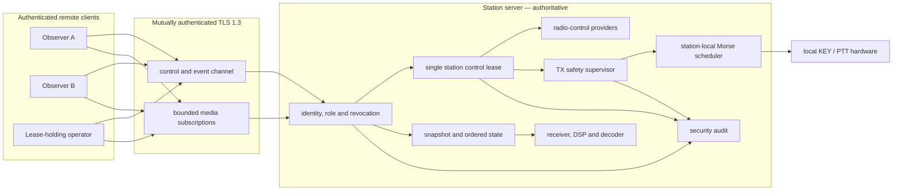
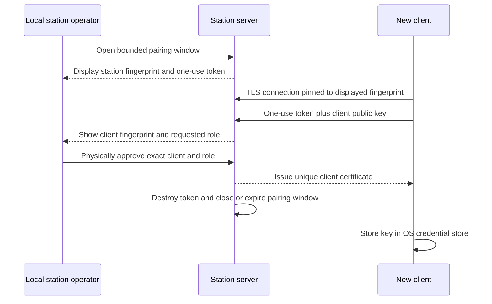
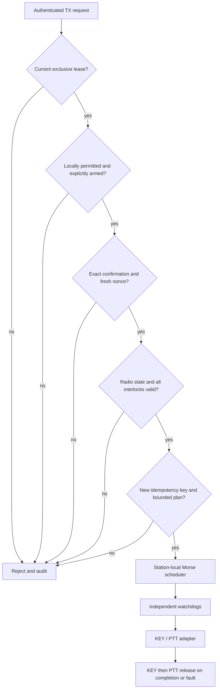

# Secure remote operation specification

Status: implementation-ready design

This specification defines how CW Buddy operates as a station server and as
one or more remote clients. It refines the security boundary accepted in
[ADR 0002](decisions/0002-secure-remote-operation.md). The station is always
authoritative for receiver state, radio control, decoding, logging and every
transmit safety decision.

The words **MUST**, **MUST NOT**, **REQUIRED**, **SHOULD**, **SHOULD NOT** and
**MAY** are normative requirements.

## Goals

- Permit multiple authenticated clients to observe one station concurrently.
- Permit exactly one client to control the station at a time.
- Encrypt and authenticate every application data channel.
- Keep radio control and Morse timing at the station.
- Fail safely when a client, server, device or network path fails.
- Allow low-bandwidth clients to receive decoded events without audio or a
  full waterfall.
- Keep the protocol versioned, bounded, testable and independent of UI state.

## Non-goals for the first release

- Direct exposure of a station port to the public internet.
- Anonymous or password-only access.
- A browser client or plaintext compatibility transport.
- Remote serial-port, paddle-edge, KEY-edge or PTT-edge forwarding.
- Restoring control, arming or queued transmission after reconnect.
- Treating a VPN as a replacement for application authentication.

## Security invariants

The implementation is unacceptable unless all of these remain true:

1. An unpaired client cannot obtain station data, including decoded text.
2. Both endpoints authenticate cryptographically before application messages
   are accepted.
3. Control, events, audio, spectrum, waterfall and optional IQ are encrypted
   and integrity protected.
4. A TLS warning, invalid certificate, unknown client, revoked credential or
   station-pin mismatch closes the connection. There is no bypass action.
5. Multiple clients may receive, but only the holder of the station-wide
   control lease may change station state or request transmission.
6. Holding a lease does not arm TX or bypass any local safety gate.
7. Decoder output and remote suggestions never directly control KEY or PTT.
8. Network loss, lease loss, shutdown and hardware faults cancel queued work
   and cause station-local KEY-then-PTT release.
9. A repeated, delayed or reordered request cannot transmit twice.
10. No client can cause unbounded memory, queue, CPU, disk or connection growth.

## Deployment boundary

The supported first deployment is a trusted LAN or operator-managed VPN. The
server MUST bind only to an explicitly selected interface and MUST default to
disabled. Loopback plaintext MAY exist in test builds, but production packages
MUST reject `ws://` and every unencrypted application transport.

Raw internet port forwarding is unsupported. A later reverse-proxy profile
requires separate review and must preserve end-to-end client identity, TLS
verification, limits, WebSocket upgrades and source-address audit semantics.
TLS termination that leaves an unencrypted network hop is unacceptable.

Automatic discovery is initially disabled. Manual address entry or a locally
displayed pairing code avoids broadcasting callsign, radio or operator
identity. Future discovery MUST advertise only a generic service and opaque
station identifier; pairing and authentication remain mandatory.

## Component model

Observers subscribe to bounded receive products. The lease holder may request
state changes, but TX still passes through the independent station safety
supervisor and station-local scheduler.

## Runtime roles

### Standalone

UI, receivers, decoder, radio control, keying and logging run locally. Network
listeners do not exist unless the active profile explicitly enables them.

### Station server

The server owns every physical and logical station resource. It may be headless
only after a local emergency-release mechanism and visible status interface are
defined. Restart leaves remote control inactive and TX disarmed.

### Remote client

The client projects authenticated station state and submits authorized
requests. It never treats cached state as authority or opens station hardware
through the protocol.

## Identity, pairing and key custody

On explicit server setup, the station creates a private station certificate
authority and server identity. Keys MUST use the platform cryptographic
provider where possible and be non-exportable where supported. The certificate
identifies an opaque station ID, not an operator callsign.

The client stores the station public-key pin established during local pairing.
Public-CA validation alone is insufficient for a paired native client. Pin
rotation requires an authorized overlap ceremony; unexpected replacement is a
hard failure.

Every client receives a unique certificate and opaque client ID. Credentials
MUST NOT be shared. The server stores the public identity, display name,
permitted roles, creation and last-seen times, and revocation state. It never
stores the client's private key.

### Pairing ceremony

The pairing window MUST be opened locally, expire within five minutes, permit a
bounded number of attempts and close after success. The random token is
single-use and travels only inside the pinned encrypted channel. Pairing does
not grant a control lease or arm TX.

Private keys and refresh material MUST use Windows CNG/Credential Manager,
macOS Keychain or Linux Secret Service/libsecret where available. A file
fallback requires explicit acknowledgement, restrictive permissions and
encryption under an operator recovery secret. Secrets MUST NOT appear in
QSettings, profiles, logs, crash reports or diagnostic captures.

Revocation immediately prevents new handshakes and closes the client's active
connections. Certificate expiry and rotation must be testable without changing
station identity.

## Transport

- TLS 1.3 is REQUIRED for every production channel.
- Mutual certificate verification is REQUIRED.
- The client verifies the server chain, station ID and stored pin.
- The server verifies the client chain, identity, expiry and revocation.
- TLS errors MUST NOT be ignored programmatically or by the user.
- Control-message compression is disabled.
- Diagnostics report TLS/backend versions without exposing key material.

The first implementation uses secure WebSockets for control/events and
separate binary media connections. Media separation prevents slow waterfall or
audio consumers from blocking emergency control messages.

| Channel | Direction | Contents | Priority |
|---|---|---|---|
| Control | bidirectional | commands, acknowledgements, lease and safety | highest |
| Events | server to client | state deltas and decoder events | high |
| Audio | server to client | sequenced Opus receive audio | medium |
| Visual | server to client | spectrum and waterfall frames | low |
| IQ | server to client | optional bounded raw IQ | lowest/opt-in |

All channels bind to the same authenticated client session. A media connection
requires a short-lived, single-use channel-binding ticket issued over the
control session; it cannot increase the client's role.

## Versioned wire contract

Messages use a length-prefixed generated binary schema. Parsing is allocation-
bounded before semantic dispatch. Every envelope contains protocol major/minor,
station ID, session ID, connection epoch, monotonic sequence, type, bounded
payload length, unique request/event ID, station monotonic creation time and an
expiry where relevant.

Unknown major versions are rejected. Unknown optional fields from compatible
minor versions are ignored only where the schema allows it. Invalid types,
enums, numbers, frequencies and strings are rejected before application
services receive them.

Each command receives a terminal acknowledgement with request ID,
authoritative resulting-state revision, outcome and safe diagnostic text. The
client never infers success from its locally changed UI.

## Multiple clients and exclusive control

The station MAY serve multiple authenticated observers concurrently. Every
observer has independent subscriptions, rates and queue budgets. A slow client
MUST NOT delay DSP, decoding, another client, the operator, the safety
supervisor or hardware release.

There is exactly one station-wide **control lease** per station profile. It
covers all coupled RX radios, TX radios, VFOs, audio routing, SDRs, transverter
offsets, CAT providers, keyers and QSO/TX workflows. This prevents two clients
from independently controlling resources that affect the same station.

Only the lease holder may change RX/TX frequency, mode, split, filters, shared
routing or selected devices; edit operational QSO state; arm/disarm remote TX;
submit/cancel/reorder a message; or request TUNE, KEY or PTT-related action.
Personal presentation settings remain client-local. An administrator may pair,
revoke and configure permissions but cannot operate without separately
acquiring the lease.

### Lease state machine

```mermaid
stateDiagram-v2
  [*] --> Free
  Free --> Held: authorized acquire
  Held --> Held: authenticated heartbeat
  Held --> Releasing: voluntary release
  Held --> Revoked: admin takeover / revocation
  Held --> Expired: heartbeat or connection lost
  Releasing --> Free: cancel queue; release KEY then PTT
  Revoked --> Free: disarm; cancel; release hardware
  Expired --> Free: disarm; cancel; release hardware
```

The lease has a unique generation and short monotonic expiry. A heartbeat
renews only the same authenticated session and generation. A prior connection's
lease ID is invalid. Voluntary transfer requires release before acquisition.

Forced takeover is an administrator action shown at both ends. It first
disarms TX, cancels queued work and invokes emergency KEY-then-PTT release. The
new client then acquires a fresh lease and independently arms. There is no
seamless transfer during transmission.

## State synchronization and reconnect

Server state has a process epoch and increasing revision. After authentication,
the client receives a complete snapshot and then ordered deltas. A sequence
gap, epoch change or invalid dependency stops control commands and causes a
fresh snapshot request.

Snapshots include inventory, authoritative RX/TX state, decoder observations,
callsign-policy revision, logging state, subscription health, lease summary,
TX safety state and audit cursor. They exclude keys, confirmation secrets and
unrestricted log contents.

Reconnect restores identity and permitted subscriptions only. It MUST NOT
restore a control lease, TX arming, confirmation nonce, queued message, TUNE or
incomplete command.

## Receive subscriptions

Independent profiles include events only; decoded events plus sparse spectrum;
Opus audio plus normal spectrum/waterfall; high-rate visual data; and explicitly
enabled IQ within capacity.

Every profile has fixed rate, resolution, queue-depth and bandwidth ceilings.
When a client falls behind, superseded visual frames are dropped and quality is
downgraded before disconnection. Backlogs never grow without bound. Control
and safety traffic cannot be starved by media.

Audio frames carry stream ID, sequence, station monotonic timestamp, duration
and format revision. A bounded client jitter buffer reports loss. Remote audio
quality never changes station decoder input.

## Authorization

Authorization is checked at message admission and again in the owning service.
A connected socket is not blanket authorization.

| Action | Observer | Operator without lease | Lease holder | Administrator |
|---|---:|---:|---:|---:|
| Read permitted state | yes | yes | yes | yes |
| Subscribe to permitted RX media | yes | yes | yes | yes |
| Acquire control lease | no | yes | already held | only if also operator |
| Change CAT/routing state | no | no | yes | no implicit right |
| Arm or request TX | no | no | guarded | no implicit right |
| Pair/revoke clients | no | no | no | yes |

Permissions may further restrict receivers, radios and subscriptions. Denials
are logged without echoing sensitive payloads.

## CAT and shared-station control

Every change includes the expected state revision and intended resource. The
server rejects stale compare-and-set requests rather than overwriting a newer
change. Provider-confirmed state, not transport acknowledgement, determines
success.

The server validates capability, ownership, band, mode, split, transverter
mapping and configured limits. A network receiver cannot acquire or redirect a
local transmitter. Full-duplex and dual-radio profiles remain one lease domain
even when RX and TX use separate devices.

## Transmit protocol and safety

The client submits a complete normalized CW message with WPM, weighting,
target, expected radio state, exact operator-confirmed callsign, confirmation
nonce and idempotency key. It never submits timed element edges.

The station independently validates authenticated identity; current lease;
local remote-TX permission; explicit client arming; exact confirmation;
policy/ignore lists; radio, mode and band state; message/WPM/queue bounds; a
fresh idempotency key; and every local interlock.

Independent stops include continuous KEY and message-duration limits, bounded
queue depth, PTT lead/tail limits, heartbeat/lease expiry, cancellation,
emergency stop, physical inhibit, CAT mismatch, device removal, adapter error
and shutdown. TUNE retains its hard 15-second limit. Faults latch a safe state
requiring explicit reset.

Decoder output, contextual inference, callsign suggestions and Auto-QSO may
create visible proposals only. They cannot create exact confirmation or bypass
arming.

## Replay and duplicate protection

TLS protects the live record stream, but requests also require idempotency
across reconnect and retry. A bounded server cache retains terminal request IDs
for current and recent epochs. A duplicate receives the original outcome and
is never executed again.

Sequences reject reordering within a session. Nonces are single-use and bound
to client identity, lease generation, action and short expiry. Client wall time
is never trusted for Morse timing or safety deadlines.

## Resource and denial-of-service limits

Every type receives explicit encoded-size, allocation, rate, concurrency and
queue limits. The server enforces global/per-client connections, handshake and
authentication timeouts, failed-auth throttling, frame sizes, message rates,
parser nesting/string bounds, subscription budgets, bounded request/audit
retention, idle timeouts and deterministic shedding priorities.

Malformed or excessive traffic is rejected before radio, decoder or TX
services. Repeated violations close the connection and create a rate-limited
audit record.

## Audit, privacy and diagnostics

The station records connection boundaries, authenticated client ID, role
decisions, pairing/revocation, lease transitions, denied actions, CAT changes,
TX outcomes, safety faults and emergency release.

Logs MUST NOT contain private keys, pairing tokens, certificate exports,
confirmation nonces, authentication material or unrestricted message payloads.
Decoded/transmitted text is recorded only under explicit station logging
policy. Diagnostic export redacts credentials and private identifiers.

Audit storage is bounded and administrator-only. Future tamper-evident export
may hash-chain signed batches but does not replace host security.

## Failure behavior

| Failure | Required result |
|---|---|
| Unknown/revoked client | admission fails; no station state disclosed |
| Station pin/certificate error | connection fails closed |
| Event sequence gap | control pauses; full snapshot requested |
| Media congestion | media drops/downgrades; control unaffected |
| Operator disconnect/heartbeat loss | lease expires; queue cancels; TX disarms |
| Server restart | new epoch; no lease, arming or queue restored |
| CAT/device mismatch | command fails; active TX releases safely |
| Duplicate TX request | original result returned; no second execution |
| Administrator takeover | old lease revoked; emergency release; fresh acquire |
| Local emergency stop | immediate KEY-then-PTT release; latched fault |

## Implementation sequence

1. **Protocol and threat model:** freeze identities, roles, envelopes, limits
   and errors; generate schema types; fuzz parsers; extend the existing lease
   tests to station-wide scope.
2. **TLS identity and local pairing:** implement TLS 1.3, mutual verification,
   pinning, one-use pairing, unique certificates, OS key storage, revocation and
   rotation.
3. **Multi-client receive-only service:** implement snapshot/delta state and
   independent observers; prove slow clients cannot affect DSP or each other.
4. **Encrypted media:** add Opus audio, visual bandwidth profiles, bounded
   queues and downgrade; keep IQ opt-in and capacity-gated.
5. **Exclusive operator control:** connect the station-wide lease to provider-
   neutral CAT/routing with compare-and-set changes, takeover and audit.
6. **Remote TX:** connect complete messages to the local guard/scheduler; add
   confirmation nonce, idempotency and every disconnect/fault release.
7. **Hardening:** run fuzzing, saturation, key-lifecycle and network fault
   injection; publish LAN/VPN guidance; require independent security review
   before considering internet exposure.

## Verification matrix

Automated tests MUST cover valid, unknown, expired, revoked and wrong-station
certificates; pin mismatch and authorized rotation; pairing expiry/reuse/flood;
every role/message combination; many observers with one lease holder; racing
lease acquisition, renewal, expiry and takeover; malformed, oversized,
duplicated, delayed and reordered frames; snapshot gaps and epoch changes; slow
media consumers; stale CAT changes; duplicate TX before/after reconnect; loss
or revocation in every TX state; device/CAT/scheduler/shutdown faults; physical
KEY-then-PTT release deadlines; and OS key storage on Windows, macOS and Linux.

No on-air remote-TX test is permitted until mocks, fault injection and the
documented physical loopback procedure pass.

## Standards and implementation references

- [RFC 8446 — TLS 1.3](https://www.rfc-editor.org/rfc/rfc8446)
- [RFC 6455 — WebSocket Protocol](https://www.rfc-editor.org/rfc/rfc6455)
- [Qt QSslConfiguration](https://doc.qt.io/qt-6/qsslconfiguration.html)
- [Qt QWebSocket](https://doc.qt.io/qt-6/qwebsocket.html)
- [OWASP TLS guidance](https://cheatsheetseries.owasp.org/cheatsheets/Transport_Layer_Security_Cheat_Sheet.html)
- [OWASP WebSocket security](https://cheatsheetseries.owasp.org/cheatsheets/WebSocket_Security_Cheat_Sheet.html)
- [NIST SP 800-63B](https://pages.nist.gov/800-63-4/sp800-63b.html)
